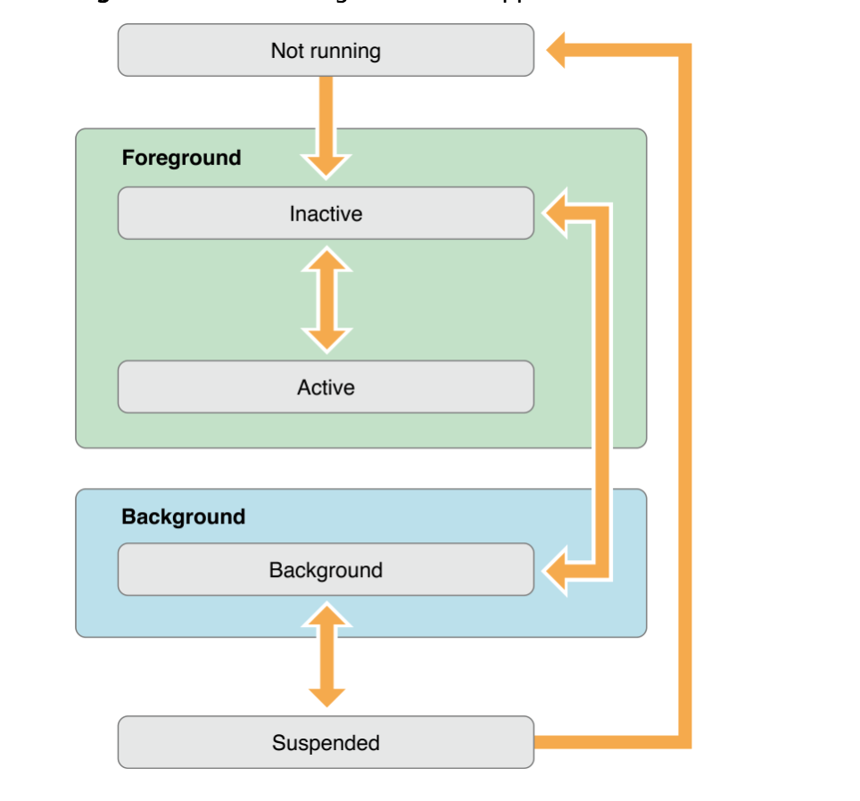
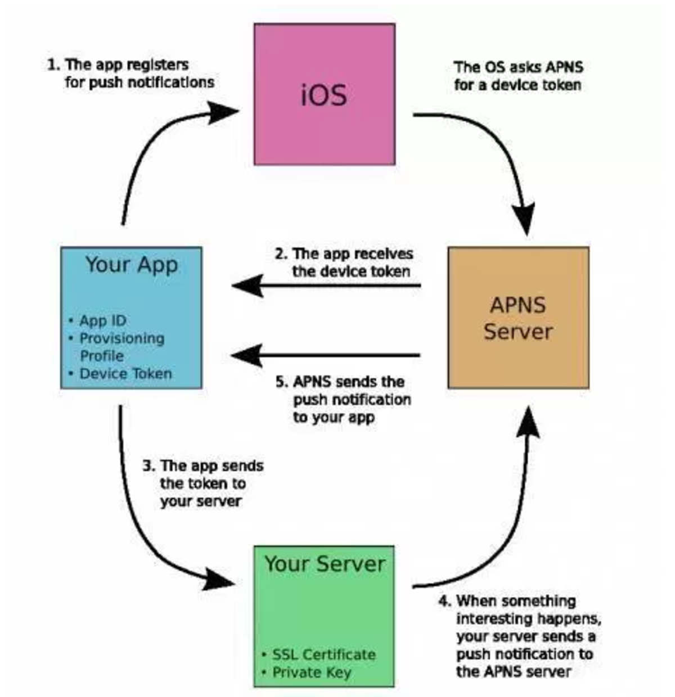
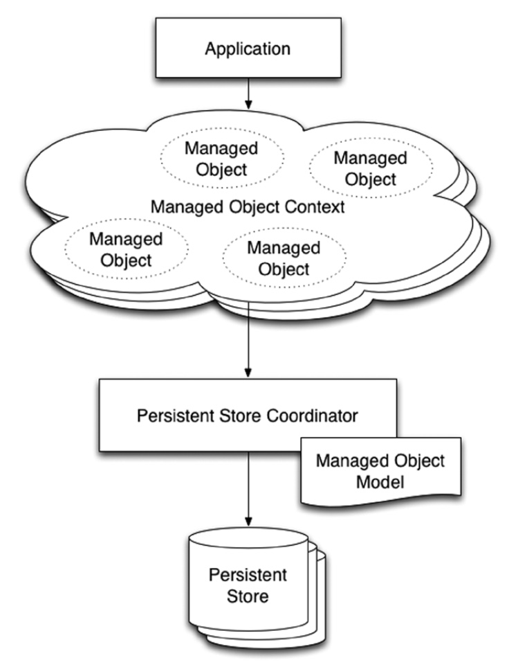
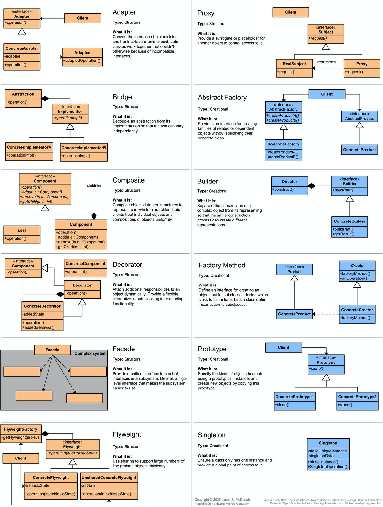
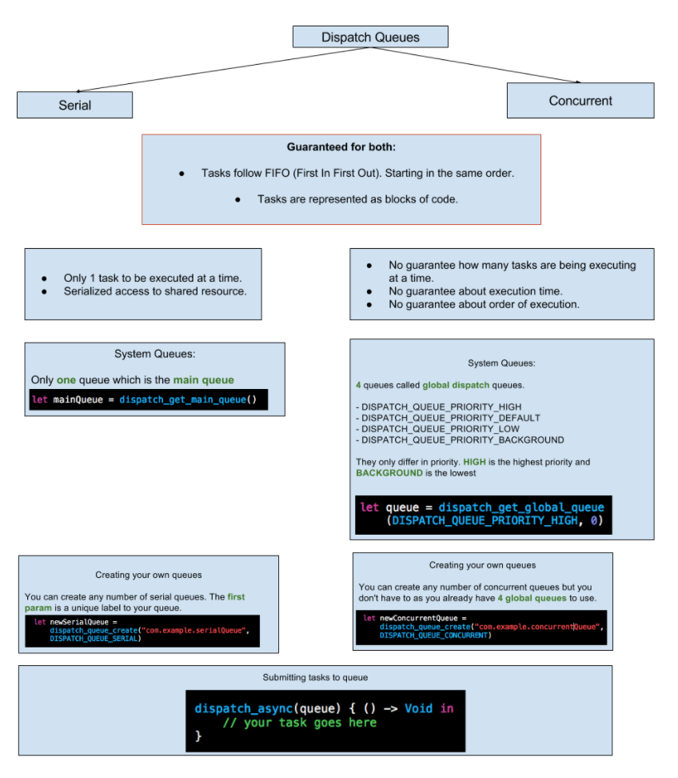
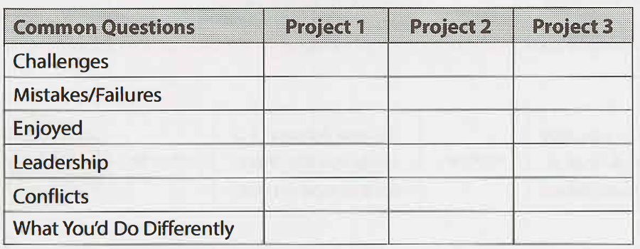

# iOS-interview

## <a name='contents'>Table of Contents</a>
* [ON SITE](#on-site)
* [TOP QUESTIONS](#top-questions)
* [Cocoa touch](#cocoa-touch)
-----------
* [Memory Management](#memory-management)
* [Networking](#networking)
* [Multithreading](#multithreading)
* [Data persistance](#data-persistance)
* [Testing](#testing)
* [CoreAnimation, CoreGraphics, CoreText](#coreanimation-coregraphics-coretext)
* [Patterns(2,5,10)](#patterns)
* [Maps](#maps)
* [Swift](#swift)
* [Intermediate Swift](#intermediateswift)
* [Advanced Swift](#advancedswift)
* [Objective-C](#objective-c)
-----------
* [Code Puzzels](#code-puzzels)
* [Code](#code) 
* [Algorithm](#algorithm)
* [SD](#sd)
-----------
* [General](#general)
-----------
* [Learning](#learning)
* [Libraries](#libraries)
* [HomeWork](#homework)
* [Podcasts](#podcasts)
* [Books](#books)
* [Websites](#websites)
* [Companies](#companies)
* [Stories](#stories)
* [Process](#process)
* [Credits](#credits)

-----------
- Stack, Queue, Tree, LinkedList, Graph directed(n*(n-1)/2) undirected(n*(n-1))
- backtracing, 
- 6, R, DP, BFS, DFS -> file
- permutation, palindrom, 1.5, 1.6, 1.7, 1.8, 1.9,2->16.1, 17
- api, touch, coredata, url
- Task Scheduler, Knap Sack, Intervals, LRU
- Max/Min Heap, PriorityQ, AVL Tree/ RB Tree
- Splay tree, ABTree
- Minimum spamming tree
- Topological sort
- bomberman, grid, tree, dp, 2 bfs, merging

- Union-Find [link](https://github.com/raywenderlich/swift-algorithm-club/tree/master/Union-Find)
- trie [link](https://github.com/raywenderlich/swift-algorithm-club/tree/master/Trie)
- thread binary tree [link](https://github.com/raywenderlich/swift-algorithm-club/tree/master/Threaded%20Binary%20Tree)
- segmented tree [link](https://github.com/raywenderlich/swift-algorithm-club/tree/master/Segment%20Tree)
- radix tree [link](https://github.com/raywenderlich/swift-algorithm-club/tree/master/Radix%20Tree)
- minimum spaning tree [link](https://github.com/raywenderlich/swift-algorithm-club/tree/master/Minimum%20Spanning%20Tree%20(Unweighted))
- red black tree [link](https://github.com/raywenderlich/swift-algorithm-club/tree/master/Minimum%20Spanning%20Tree%20(Unweighted))
- b tree [link](https://github.com/raywenderlich/swift-algorithm-club/tree/master/B-Tree)
- avl tree [link](https://github.com/raywenderlich/swift-algorithm-club/tree/master/AVL%20Tree)
- priority Q
- Dijkstra, BFS from two ends

- tomorrow
- one week
- no interview preparing
- looking around
- applying
- preparing
- [lvl](https://github.com/bohdanorlov/ios-skills-matrix)
- [clear code](https://github.com/sergdort/CleanArchitectureRxSwift)
- hig, M
- [example+](https://www.raywenderlich.com/148513/grand-central-dispatch-tutorial-swift-3-part-1)
- [interview prep1](https://engineering.pandora.com/engineering-interviews-at-pandora-eb339d80afc0)
- [interview prep2](https://blog.usejournal.com/a-complete-guide-to-getting-hired-as-an-ios-developer-in-2018-d7dcf50dc25)


```swift

a = [(1,2),(2,3),(100,5)]
b = [(0,5),(1,1),(100,6)]

i = 0; j = 0
result = 0
while i < len(a) and j < len(b):
    if a[i][0] == b[j][0]:
        result += a[i][1] * b[j][1]
        i += 1
        j += 1
    elif a[i][0] < b[j][0]:
        i += 1
    else:
        j += 1
print(result)

```

### [quiz](https://www.hackingwithswift.com/test)

1. leet
2. pramp
3. interviewcake
4. sd
5. oop
6. ctci
7. daily
8. kaggle + ml [link](https://www.analyticsvidhya.com/blog/2016/09/40-interview-questions-asked-at-startups-in-machine-learning-data-science/)
9. pd
10. ps

# On site
[[⬆]](#contents)
-----------
1. Do your homework. Research recent news about the comapny and look over http://www.Compan_name.com/about. Be sure you know about the company and product, and try to form an opinion about what you like about it and what you don’t. “if you could add any feature to our product, what would it be?”, with follow-up questions about how the implementation might be done.
2. Why here? (“I like building high-performance user-facing services that interact with a lot of other systems, and love being on-call”), but you might not want to be too specific (“The only thing I have ever wanted to do is convolutional neural networks for image recognition”), or too vague (“Something with Java.. or maybe iOS mobile development, I don’t really care”) or too mercenary (“I just need to get some Hadoop experience to fill up a gap in my resume”).
3. Practice your whiteboard skills. Try to find a middle ground between talking too much and too little. CTCI. Also,  https://www.glassdoor.com, http://www.careercup.com, and http://codekata.pragprog.com that will help you get up to speed.
4. 

# Top questions
[[⬆]](#contents)
-----------

### iOS
1. UIKit
2. Core Data
3. Networking
4. Encription
5. Animation
6. RxSwift
7. UIFoundation
8. Animation

### Theory
1. class vs struct
2. frame vs bounds + scroll view
3. GCD vs NSOperationQueue
4. MVVM vs MVC vs MVP
5. ARC + ObjC
6. App LifeCycle, View LifeCycle
7. delegate vs notification center vs callback
8. Gesture recogniser
9. URL session request
10. init
11. How protocols interact with generics?
12. Generics
12. Protocols: Hashable, HashFunctions
14. objC NULL, inter
React, Android
callback KVO BOX
### OnSite
1. Linked-List
2. Trees
2.1 if a binary tree is a sum tree

3. Merge sort
4. BFS, DFS
4.1 top down, bottom up

5. Software design
5.1 design google docs
5.2 online shop
5.3 senior-lead/architect/manager

6. Design [SD link](https://www.hiredintech.com/courses/system-design), [DS link](http://highscalability.com/), [DS link](https://github.com/dmyma/Core-Interview/tree/master/Data%20Structure)
 ### HW
API calls
Header types


# Topics

| Data Structure  | Algorithms    | Concepts      | SD/OOP        | Testing/Analysing |
| -------------   | ------------- | ------------- | ------------- | -------------     | 
| Array           | MS            | Big O time    | Inter         |                   | 
| Linked List     | QS            | Big O space   | Patterns      |                   | 
| Trees           | Bs            | Recrsion      |               |                   |
| HashTable       | BFS/DFS       | Dynamic Pr/MM |               |                   | 
| Graphs  	  | Astar         | prob/comb     |               | 	              |
| Heaps    	  | FW, FF, J     | process/thread|               | 		      |
| Queues, Stacks  |               | concuracny    |               | 		      |

1. Algorightms

2. Logical
3. Linked list
4. Arrays
5. Trees
6. Stacks
7. Recursion and dynamic programming
8. Bit manipulation
9. OoD
10. System design and scalability
11. Searching and Sorting
12. 

13. Threads
14. Databases
15. BFS, DFS
- leetcode, 2 alg books
- inter
- RAY
- code/algorythms/knowledge
- rxSWIFT 
- POP

2. iOS code

- MErge two sorted arrays of intervals 

- Login system
- Multithreading
- CoreData

- FizzBuzz
- BinarySearch
- ReverseLinkedList

- homeworks

3. iOS theory
- Class vs Struct
- networking
- testing
- filter, map, reduce, flatMAP
- for,forEACH, merging dict, sets
- Testing
- 3D party libraries
- Gesture recogniser
- networking(Rest, Oauth2)
- debugging
- modulo 
- autolayout/sizeclasses
- nsnotification center

- optional biding 
- general expression
- question E, A, B, 50, 5zero
- UIViewController
- notification center
- gcd, queues, operations, threades

- Decorator vs Inheritance
- alg hash table
- ood/scalability

- Networking rest
- test
- anotation
- reverse geocoding
- Location Manager
- Algorithm design


- e,2,
- What is collection?
- what is Protocol?
- what is arc, GCD?

4. SYSTEM DESIGN, OOD


## Extra:

### Alg

1. Two numbers
2. Add two numbers iterative approach 
3. Longest substring without repeating
4. Tasks scheduler
5. Median of two sorted arrays

### Swift 
- MRC and ARC

###

###


## Cocoa touch 
[[⬆]](#contents)
-
<details><summary>Name the framework that is used to construct application’s user interface for iOS. </summary>
The UIKit framework is used to develop application’s user interface for iOS. UIKit framework provides event handling, drawing model, windows, views, and controls specifically designed for a touch screen interface.
</details>
<details><summary>What is the diference between struct and class?</summary>
An  enum  is an object type whose instances represent  distinct  predefined  alternative values. Think of it as a list of known possibilities. An enum is the Swift way to express a set of constants that are alternatives to one another. An enum declaration includes case statements. Each case is the name of one of the alternatives. An instance of an enum will represent exactly one alternative — one case.

Methods A  method  is a function — one that happens to be declared at the top level of an object type declaration. This means that everything said about functions in  Chapter 2 applies. By default, a metho

Properties A  property  is a variable — one that happens to be declared at the top level of an object type declaration. This means that everything said about variables in  Chapter 3 applies. A property has a fixed type; it can be declared with  var  or  let; it can be stored or computed; it can have setter observers. An instance property can also be declared  lazy.

Structs A  struct  is the Swift object type  par excellence. An enum, with its fixed set of cases, is a reduced, specialized kind of object. A class, at the other extreme, will often turn out to be overkill; it has some features that a struct lacks, but if you don’t need those features, a struct may be preferable.

Classes A  class  is similar to a struct, with the following key differences: Reference type Classes are reference types. This means, among other things, that a class instance has two remarkable features that are not true of struct instances or enum instances: Mutability A class instance is mutable in place. Even if your reference to an instance of a class is a constant (let), you can change the value of an instance property through that reference. An instance method of a class never has to be marked  mutating  (and cannot be). Multiple references When a given instance of a class is assigned to multiple variables or passed as argument to a function, you get multiple references to  one and the same object. Inheritance A class can have a superclass. A class that has a superclass is a  subclass  of that superclass. Class types can thus form a hierarchical tree. In Objective-C, classes are the only object type. Some built-in Swift struct types are magically bridged to Objective-C class types, but your custom struct types don’t have that magic. Thus, when programming iOS with Swift, a primary reason for declaring a class, rather than a struct, is as a form of interchange with Objective-C and Cocoa.

Value Types and Reference Types A major difference between enums and structs, on the one hand, and classes, on the other, is that enums and structs are  value types, whereas classes are  reference types. A value type is  not mutable in place, even though it seems to be. For example, consider a struct. A struct is a value type:
</details>
<details><summary>What is let and var in Swift?</summary></details>
<details><summary>What is Optional in Swift and nil in Swift and Objective-C?</summary></details>
<details><summary>What are properties and instance variables in Objective-C and Swift?</summary></details>
<details><summary>What is a protocol (both Obj-C and Swift)? When and how is it used?</summary></details>
<details><summary>What is a category/extension? When is it used?</summary></details>
<details><summary>What are closures/blocks and how are they used?</summary></details>
<details><summary>What is MVC?</summary></details>
<details><summary>What are Singletons? What are they used for?</summary></details>
<details><summary>What is Delegate pattern in iOS?</summary></details>
<details><summary>What is KVO (Key-Value Observation)?</summary></details>
<details><summary>What does iOS application lifecycle consist of?</summary></details>
<details><summary>What is View Controller? What is its lifecycle?</summary></details>

<details><summary>What are the challenges in working with UI on iOS?</summary></details>
<details><summary>What do you use to lay out your views correctly on iOS?</summary></details>
<details><summary>What are CGRect Frames? When and where would you use them?</summary></details>
<details><summary>What is AutoLayout? When and where would you use it?</summary></details>
<details><summary>What are compression resistance and content hugging priorities for?</summary></details>
<details><summary>How does AutoLayout work with multi-threading?</summary></details>
<details><summary>What are the advantages and disadvantages of creating AutoLayouts in code versus using storyboards?</summary></details>
<details><summary>How do you work with storyboards in a large team?</summary></details>
<details><summary>How do you mix AutoLayout with Frames?</summary></details>
<details><summary>What options do you have with animation on iOS?</summary></details>
<details><summary>How do you do animation with Frames and AutoLayout?</summary></details>
<details><summary>How do you work with UITableView?</summary></details>
<details><summary>How do you optimize table views performance for smooth, fast scrolling?</summary></details>
<details><summary>How do you work with UICollectionView?</summary></details>
<details><summary>How do you work with UIScrollView?</summary></details>
<details><summary>What is UIStackView? When would you use it and why?</summary></details>
<details><summary>What alternative ways of working with UI do you know?</summary></details>
<details><summary>How do you make a pixel-perfect UI according to a designer’s specs?</summary></details>
<details><summary>How do you unit and integration test UI?</summary></details>
<details><summary>Beyond MVC. Design Pattens, Architecture, FRP, and Dependencies Management.</summary></details>
<details><summary>What design patterns are commonly used in iOS apps?</summary></details>
<details><summary>What is MVC?</summary></details>
<details><summary>What is MVVM?</summary></details>
<details><summary>What are the common layers of responsibility that an iOS application has?</summary></details>
<details><summary>What are SOLID principles? Can you give an example of each in iOS/Swift?</summary></details>
<details><summary>How do you manage dependencies in iOS applications?</summary></details>
<details><summary>What is Functional Programming and Functional Reactive Programming?</summary></details>
<details><summary>What are the design patterns besides common Cocoa patterns that you know of?</summary></details>

 
<details><summary>App Delegate Methods</summary>
-UIApplicationDidFinishLaunching
-UIApplicationWillResignActive
-UIApplicationDidBecomeActive
-UIApplicationWillEnterForeground
-UIApplicationDidEnterBackground
-UIApplicationwillterminate
	</details>
<details><summary>App States</summary>
### States

Apps developed for early iOS versions (before iOS 4.0) supported three states: non-running, inactive, and active. An application delegate for pre-iOS 4.0 apps received two important method calls: applicationDidFinishLaunching and applicationWillTerminate. When an app received an applicationDidFinishLaunching message, it was an opportunity for information to be retrieved from the previous launch to restore the app to its last used state. The status, applicationWillTerminate, was used to notify the app when the app was preparing to shut down. This gave the developer an opportunity to save any unsaved data or specific state information.

Currently, there are five possible application states that would be cause for the app to prepare for a transition - such as a shutdown or moving to the background. In certain cases, an app might need to continue processing in the background. However, there is certainly no reason for the app to process any graphics, animations, or display-specific routines. The five states of an iOS app - as listed in the iOS App Programming Guide - include the following:

- Non-running - The app is not running.
- Inactive - The app is running in the foreground, but not receiving events. An iOS app can be placed into an inactive state, for example, when a call or SMS message is received.
- Active - The app is running in the foreground, and receiving events.
- Background - The app is running in the background, and executing code.
- Suspended - The app is in the background, but no code is being executed.
- The seven most important application delegate methods

The operating system calls specific methods within the application delegate to facilitate transitioning to and from various states. The seven most important application delegate methods a developer should handle are:

### application:willFinishLaunchingWithOptions
Method called when the launch process is initiated. This is the first opportunity to execute any code within the app.

### application:didFinishLaunchingWithOptions
Method called when the launch process is nearly complete. Since this method is called is before any of the app's windows are displayed, it is the last opportunity to prepare the interface and make any final adjustments.

### applicationDidBecomeActive
Once the application has become active, the application delegate will receive a callback notification message via the method applicationDidBecomeActive.

This method is also called each time the app returns to an active state from a previous switch to inactive from a resulting phone call or SMS.

### applicationWillResignActive
There are several conditions that will spawn the applicationWillResignActive method. Each time a temporary event, such as a phone call, happens this method gets called. It is also important to note that "quitting" an iOS app does not terminate the processes, but rather moves the app to the background.

### applicationDidEnterBackground
This method is called when an iOS app is running, but no longer in the foreground. In other words, the user interface is not currently being displayed. According to Apple's UIApplicationDelegate Protocol Reference, the app has approximately five seconds to perform tasks and return. If the method does not return within five seconds, the application is terminated.

### applicationWillEnterForeground
This method is called as an app is preparing to move from the background to the foreground. The app, however, is not moved into an active state without the applicationDidBecomeActive method being called. This method gives a developer the opportunity to re-establish the settings of the previous running state before the app becomes active.

### applicationWillTerminate
This method notifies your application delegate when a termination event has been triggered. Hitting the home button no longer quits the application. Force quitting the iOS app, or shutting down the device triggers the applicationWillTerminate method. This is the opportunity to save the application configuration, settings, and user preferences.

### Application state changes

Every iOS app is always in one of the five app states. The operating system manages the app state, but the app itself is responsible for managing important tasks to ensure smooth transitions between the states. Developers are required to respond appropriately to app state transitions.

With multitasking capability, the latest iOS version manages the resources available to every app. It is important to note, however, that the operating system limits what an app can do in the background. If an app needs to continue running in the background (with limited functionality), you must request permission.

### Launching the app

The moment a user taps the app icon, the app begins to change state. The app delegate receives an application:willFinishLaunchingWithOptions method call, and the app state changes from non-running to inactive. Once in the inactive state, the app delegate will receive an application:didFinishLaunchingWithOptions method call, giving the app an opportunity to make final adjustments before the interface is displayed. If the app has not been designed to launch in the background, the operating system will activate the app, set the app state to active, and send the applicationDidBecomeActive method call to the app delegate.

### Interruptions

On occasion, the iOS app will need to respond to interruptions. An alert-based interruption - such as a phone call - causes the app to move into an inactive state. The app delegate will receive an applicationWillResignActive method call, allowing the app an opportunity to prepare for a temporary inactive state. If the user chooses to ignore the interruption, or the interrupting process has terminated, the app will move back into the active state. While making the transition from inactive to active, the app delegate will receive an applicationDidBecomeActive method call.

### Switching to the background

The iOS devices make it simple to quickly switch from app to app; when a user switches to a different app, the current app moves to the background. The app can be in one of two states: background or suspended. In either case, and before switching to the background, the app delegate receives an applicationWillResignActive method call, followed by an applicationDidEnterBackground message. If in a suspended state, the app sleeps. A background state - meaning that the app is allowed to continue executing code - requires the app to monitor and handle events. Developers need to be aware that the operating system may terminate the app at any time.#
</details>

<details><summary>UIViewController lifecycle</summary>
viewDidLoad - update UI, outlets are set, bounds not set yet(no geometry)
viewWillApear - changing over display, geometry set, optimise performance,
viewWillLAyoutSubviews - called when frames changed
viewDidlayoutSubviews
viewDidApear - 
viewWillDisapear - remember whats going on and clean up, no time consuming
viewDidDisapear


</details>


## Memory Management 
[[⬆]](#contents)

<details><summary>Memory Management</summary>
- Core Data
- SQL
- Realm
</details>

<details><summary>NSThread vs NSOperation</summary>
NSThread:

1. iOS developers have to write code for the work/process he want to perform along with for the creation and management of the threads themselves.
2. iOS developers have to be careful about a plan of action for using threads.
3. iOS developer have to manage posiable problems like reuseability of thread, lockings etc. by them self.
4. Thread will consume more memory too.

NSOperation:

1. The NSOperation class is an abstract class which encapsulates the code and data associated with a single task.
2. Developer needs to use subclass or one of the system-defined subclasses of NSOperation to perform the task.
3. Add operations into NSOperationQueue to execute them.
4. The NSOperationQueue creates a new thread for each operation and runs them in the order they are added.
5. Operation queues handle all of the thread management, ensuring that operations are executed as quickly and efficiently as possible.
6. An operation queue executes operations either directly by running them on secondary threads or indirectly using GCD (Grand Central Dispatch).
7. It takes care of all of the memory management and greatly simplifies the process.
8. If you don’t want to use an operation queue, you can also execute an operation by calling its start method. It may make your code too complex.
</details> 
<details><summary>what is 'golden rule of memory management'? </summary></details> 
<details><summary>what is Arc?</summary></details>
<details><summary>what is Auto release pool?</summary></details>
<details><summary>Weak vs assign, strong vs copy?</summary></details>
<details><summary>Atomic vs nonatomic. What is the difference? How to change atomic/nonatomic setter in non ARC environment?</summary></details>
<details><summary>Why all properties reference to strong/retain?</summary></details>
<details><summary>What is NSCoder?</summary></details>


## Networking
[[⬆]](#contents)


<details> 
  <summary> Latency - time takes a given bit of information to get from one point to another on the network.</summary></details>
<details> 
  <summary> Bandwidth - to the rate at which data moves through the network once communication is established.</summary></details>
<details> 
  <summary> Bandwidth - </summary></details>
<details> 
  <summary> Which JSON framework is supported by iOS?  </summary>
SBJson framework is supported by iOS.  It is a JSON parser and generator for Objective-C. SBJson provides flexible APIs and additional control that makes JSON handling easier.

</details>

<details> 
  <summary> Advantages and disadvantages of synchronous and asynchronous communication?</summary></details>
<details> 
  <summary> What does HTTP mean, TCP?</summary></details>
<details> 
  <summary> What are the differences between head, GET, post, put?</summary></details>
<details> 
  <summary> How do I download something from the Internet? What is the difference between synchronous and asynchronous requests? A little assignment. Describe how to download an image from the web and display it in imageview.g.h-all of this should happen after you click the button.</summary></details>
<details> 
  <summary> What is rest (restful)?</summary></details>
  <details> 
  <summary> What is json?</summary></details>
  
   <details> 
  <summary> What is NSCOder class used for? </summary>
  NSCoder is an abstractClass which represents a stream of data. They are used in Archiving and Unarchiving objects. NSCoder objects are usually used in a method that is being implemented so that the class conforms to the protocol. (which has something like encodeObject and decodeObject methods in them).</details>
  
   <details> 
  <summary>What's the difference between synchronous and asynchronous connections?</summary>
  Do not freeze the app, canceletion, authentication, it's impossible to parse data on the fly</details>
  <details><summary> Explain NSURLSession?</summary>
  The NSURLSession class and related classes provide an API for downloading content via HTTP. This API provides a rich set of delegate methods for supporting authentication and gives your app the ability to perform background downloads when your app is not running or, in iOS, while your app is suspended.

To use the NSURLSession API, your app creates a series of sessions, each of which coordinates a group of related data transfer tasks. For example, if you are writing a web browser, your app might create one session per tab or window. Within each session, your app adds a series of tasks, each of which represents a request for a specific URL (and for any follow-on URLs if the original URL returned an HTTP redirect).

Like most networking APIs, the NSURLSession API is highly asynchronous. If you use the default, system-provided delegate, you must provide a completion handler block that returns data to your app when a transfer finishes successfully or with an error. Alternatively, if you provide your own custom delegate objects, the task objects call those delegates' methods with data as it is received from the server (or, for file downloads, when the transfer is complete).

Note: Completion callbacks are primarily intended as an alternative to using a custom delegate. If you create a task using a method that takes a completion callback, the delegate methods for response and data delivery are not called.
The NSURLSession API provides status and progress properties, in addition to delivering this information to delegates. It supports canceling, restarting (resuming), and suspending tasks, and it provides the ability to resume suspended, canceled, or failed downloads where they left off.</details>
  <details> 
  <summary> Explain types of NSURLSession?</summary>
  The NSURLSession API supports three types of sessions, as determined by the type of configuration object used to create the session:

- Default sessions : behave similarly to other Foundation methods for downloading URLs. They use a persistent disk-based cache and store credentials in the user's keychain.

- Ephemeral sessions : do not store any data to disk; all caches, credential stores, and so on are kept in RAM and tied to the session. Thus, when your app invalidates the session, they are purged automatically.

- Background sessions : are similar to default sessions, except that a separate process handles all data transfers. Background sessions have some additional limitations.
</details>
  
  <details> 
  <summary> Explain life cycle of URL Session?</summary>
  You can use the NSURLSession API in two ways: with a system-provided delegate or with your own delegate. In general, you must use your own delegate if your app does any of the following:

- Uses background sessions to download or upload content while your app is not running.
- Performs custom authentication.
- Performs custom SSL certificate verification.
- Decides whether a transfer should be downloaded to disk or displayed based on the MIME type returned by the server or other similar criteria.
- Uploads data from a body stream (as opposed to an NSData object).
- Limits caching programmatically.
- Limits HTTP redirects programmatically.

If your app does not need to do any of these things, your app can use the system-provided delegates. Depending on which technique you choose, you should read one of the following sections:

- Life Cycle of a URL Session with System-Provided Delegates : provides a lightweight view of how your code creates and uses a URL session. You should read this section even if you intend to write your own delegate, because it gives you a complete picture of what your code must do to configure the object and use it.

- Life Cycle of a URL Session with Custom Delegates : provides a complete view of every step in the operation of a URL session. You should refer to this section to help you understand how the session interacts with its delegate. In particular, this explains when each of the delegate methods is called.


</details>

  <details> 
  <summary>What is HTTP?</summary></details>
  <details> 
  <summary>What is REST?</summary></details>
  <details> 
  <summary>How do you typically implement networking on iOS?</summary></details>
  <details> 
  <summary>What are the concerns and limitations of networking on iOS?</summary></details>
  <details> 
  <summary>What should go into the networking/service layer?</summary></details>
  <details> 
  <summary>What is NSURLSession? How is it used?</summary></details>
  <details> 
  <summary>What is AFNetworking/Alamofire? How do you use it?</summary></details>
  <details> 
  <summary>How do you handle multi-threading with networking on iOS?</summary></details>
  <details> 
  <summary>How do you serialize and map JSON data coming from the backend?</summary></details>
  <details> 
  <summary>How do you download images on iOS?</summary></details>
  <details> 
  <summary>How would you cache images?</summary></details>
  <details> 
  <summary>How do you download files on iOS?</summary></details>
  <details> 
  <summary>Have you used sockets and/or pubsub systems?</summary></details>
  <details> 
  <summary>What is RestKit? What is it used for? What are the advantages and disadvantages?</summary></details>
  <details> 
  <summary>What could you use instead of RestKit?</summary></details>
  <details> 
  <summary>How do you test network requests?</summary></details>
   <details> 
  <summary> timeout
  promiseKit</summary></details>
  
## Multithreading 
[[⬆]](#contents)

<details> 
  <summary>Does iOS support multitasking? </summary>
iOS 4 and above supports multi-tasking and allows apps to remain in the background until they are launched again or until they are terminated.  
</details>
<details><summary>Concurancy, Thread, Task, queue</summary></details>
<details><summary>GCD</summary></details>
<details><summary>MULTIthreading </summary></details>
<details><summary>NSOPERATIONQUEUE</summary></details>
<details><summary>Closures</summary></details>
[GCD vs Q](http://www.knowstack.com/swift-3-1-concurrency-operation-queue-grand-central-dispatch/)

<details> 
  <summary> Why an app on iOS device behaves differently when running in foreground than in background? </summary>
An application behaves differently when running in foreground than in background because of the limitation of resources on iOS devices.
</details>

<details> 
  <summary> How can an operating system improve battery life while running an app? </summary>
An app is notified whenever the operating system moves the apps between foreground and background.  The operating system improves battery life while it bounds what your app can do in the background. This also improves the user experience with foreground app.
</details>

<details> 
  <summary> Which framework delivers event to custom object when app is in foreground? </summary>
The UIKit infrastructure takes care of delivering events to custom objects. As an app developer, you have to override methods in the appropriate objects to process those events.
</details>
LOOK

<details><summary>Queues</details></summary>
<details><summary>Main Queue</details></summary>
<details><summary>Global Queues </details></summary>
<details><summary>DispatchQueue.global/main</details></summary>
<details><summary>queue.sync(async)</details></summary>

 a: if let url = URL(string: “http://stanford.edu/...”) {
 }
let task = session.dataTask(with: url) { (data: Data?, response, error) in // do something with the data
DispatchQueue.main.async {
// do UI stuff here
}
    print(“did some stuff with the data, but UI part hasn’t happened yet”)
b: c: d: e:
f:
g:
h: print(“done firing off the request for the url’s contents”)


Deadlock - two threads are waiting for each other
Monitor - 
Semaphore - protects a shared resource

process vs thread swift Concurrency and Threading
FP:
reduce
map
filter
flatmap
joined
reversed
sort

prefic
containes

## Data persistance 
[[⬆]](#contents)
### (CoreData)
Realm
<details> 
  <summary>core data and different threads</summary>

Basic rules are:

Use one NSPersistentStoreCoordinator per program not per thread.
Create one NSManagedObjectContext per thread.
Never pass an NSManagedObject on a thread to the other thread.
Instead, get the object IDs via -objectID and pass it to the other thread.
More rules:

Make sure you save the object into the store before getting the object ID. Until saved, they're temporary, and you can't access them from another thread.
And beware of the merge policies if you make changes to the managed objects from more than one thread.
NSManagedObjectContext's -mergeChangesFromContextDidSaveNotification: is helpful.
Documentation
https://cocoacasts.com/core-data-and-concurrency/
https://www.raywenderlich.com/145877/core-data-tutorial-multiple-managed-object-contexts-2
</details>
<details> 
  <summary> What steps should be accomplish in order to save/fetch an object?  </summary>
Step 1  —  Describes which entity we are working with. LEts say Person.
Step 2  —  Create the our Class(PErson) NSManagedObject. The NSManagedObject will be inserted into our managed object context later when saving.
Step 3  —  Now that we have specified our entity and created a new class(person), we need to save the person’s name. In this case, we use key value coding to set the value for our key, which is specified as “name”.
Step 4  —  At this point, it’s time to save our managedObjectContext, which persists the data to the store. If an error should occur, we catch it at this point.
- Fetch
Step 1  —  Create a fetch request. A fetch request is what we use to fetch data from our Core Data store. A fetch request can be customizable to include only the results or attributes that you need. In our case, we want to fetch all objects from the Person entity.
Step 2  —  We now try to fetch data from our Core Data store and store it in our managed object context, whose job it is to create a scratchpad of sorts when dealing with managed objects.
Step 3  —  We have a simple for loop that loops through each result in our fetched items array. At this point, we print out the name of each saved object into the console.
	
https://www.codementor.io/codementorteam/core-data-tutorial-saving-and-fetching-pdphdmh50
https://developer.apple.com/library/content/documentation/Cocoa/Conceptual/CoreData/CreatingObjects.html


Application-(Managed Object Contex(Manage Object))- Persistance storage Coordinator(PS Model) - PS


What is the storage layer for in iOS applications?
What can you use to store data on iOS?
What is NSCoding?
What is NSUserDefaults?
What is Keychain and when do you need it?
How do you save data to a disk on iOS?
What database options are there for iOS applications?
How is data mapping important when you store data?
How would you approach major database/storage migration in your application?

How do access coredata?
NSManagedObjectContext

How do I you get contex?
NSPersistentContainer
(UIApplication.shared.delegate as! AppDelegate).persistentContainer

let container = (UIApplication.shared.delegate as! AppDelegate).persistentContainer let context: NSManagedObjectContext = container.viewContext

Every NSManagedObject knows the managedObjectContext it is in.

How do you access entities?
let context = AppDelegate.viewContext
  if let tweet = Tweet(context: context) {
tweet.text = “140 characters of pure joy”
tweet.created = Date() as NSDate
     let joe = TwitterUser(context: tweet.managedObjectContext)
     tweet.tweeter = joe
tweet.tweeter.name = “Joe Schmo” }

-Thread safety?
NSManagedObjectContext is not thread safe
Luckily, Core Data access is usually very fast, so multithreading is only rarely needed.
NSManagedObjectContexts are created using a queue-based concurrency model.
This means that you can only touch a context and its NSMO’s in the queue it was created on. Often we use only the main queue and its AppDelegate.viewContext, so it’s not an issue.
Thread-Safe Access to an NSManagedObjectContext context.performBlock { // or performBlockAndWait until it finishes
// do stuff with context (this will happen in its safe Q (the Q it was created on)) }
Note that the Q might well be the main Q, so you’re not necessarily getting “multithreaded.” It’s generally a good idea to wrap all your Core Data code using this.
Although if you have no multithreaded code at all in your app, you can probably skip it.
It won’t cost anything if it’s not in a multithreaded situation.

Convenient way to do database stuff in the background
The persistentContainer has a simple method for doing database stuff in the background AppDelegate.persistentContainer.performBackgroundTask { context in
// do some CoreData stuff using the passed-in context
// this closure is not the main queue, so don’t do UI stuff here (dispatch back if needed) // and don’t use AppDelegate.viewContext here, use the passed context
// you don’t have to use NSManagedObjectContext’s perform method here either
// since you’re implicitly doing this block on that passed context’s thread
try? context.save() // don’t forget this (and catch errors if needed)
}
This would generally only be needed if you’re doing a big update.
You’d want to see that some Core Data update is a performance problem in Instruments first. For small queries and small updates, doing it on the main queue is fine.
</details>


## Testing
[[⬆]](#contents)

<details><summary>Working with crash logs</summary></details>
<details><summary> Do you write unit tests? how you write in iOS?</summary></details>
<details><summary> What is TDD?</summary></details>
<details><summary> How TDD is good, and What problem does it solve?</summary></details>
<details><summary> What is Mocking, when you will use mocking?</summary></details>
<details><summary> What is UI testing?</summary></details>

<details><summary>Black or white box?</summary></details>
<details><summary>Who will use it and why?</summary></details>
<details><summary>What are the use cases?</summary></details>
<details><summary>What are the the bounds of use?</summary></details>
<details><summary>What are the failure conditions?</summary></details>

<details><summary>What to test</summary>

- data user represenation
- init of the object + fail
- api call
- transition
- each function?

</details>


## CoreAnimation CoreGraphics CoreText 
[[⬆]](#contents)
storyboard

- UIView vs CALayer

arkit: 
- ads
- movie
- lie
- shops
- wall
- audio

constraints[link](https://stackoverflow.com/questions/26180822/how-to-add-constraints-programmatically-using-swift)

<details><summary>point(inside:with:) vs hitTest(_:with:)</summary></details>
<details><summary>NSAttributedString</summary></details>
## Patterns 
[[⬆]](#contents)




https://sourcemaking.com/design_patterns

<details><summary>1 Singleton</summary> - ensures a class has only one instance and provides global point of access to it </details>
<details><summary>2 Factory Method</summary> - define an interface for creating an object, but let the subclass decide which class to instantiate</details>
<details><summary>3 ABS</summary> - provides an interface for creating families of related or depended objects without specifying heir concrete classes</details>
<details><summary>4 Builder</summary> - separates the construction of a complex object from its representation so the same construction process can create different representations</details>
<details><summary>5 Prototype</summary> - specify the kinds of objects to create using a prototypical instance, and creating new object by copying this prototype</details>

<details><summary>6 Adapter</summary>  - provides a link between two otherwise incompatible types by wrapping the "adaptee" with a class that supports the interface required by the client.</details>
<details><summary>7 Bridge</summary>  - separates the abstract elements of a class from the implementation details, providing the means to replace the implementation details without modifying the abstraction.</details>
<details><summary>Facade</summary>  - define a simplified interface to a more complex system(API)</details>
<details><summary>Flyweight</summary>  - minimizes memory usage or computational expenses by sharing as much as possible with other similar objects.</details>
<details><summary>Proxy</summary>  - provide a surrogate or placeholder object, which reference an underlying object.( virtual - load objects on demand, protection - restricting access)</details>
<details><summary>Template Method</summary>  - The Template Pattern is used when two or more implementations of an algorithm exist. The template is defined and then built upon with further variations. Use this method when most (or all) subclasses need to implement the same behavior. Traditionally, this would be accomplished with abstract classes and protected methods (as in Java). However in Swift, because abstract classes don't exist (yet - maybe someday), we need to accomplish the behavior using interface delegation.(N:  Define the skeleton of an  algorithm in an operation, deferring some steps to subclasses. Template Method lets subclasses redefine certain steps of an algorithm without changing  the algorithm's structure.  )</details>
<details><summary>Observer</summary>  - allows an object to publish changes to its state. Other objects subscribe to be immediately notified of any changes.</details>
<details><summary>Decorator</summary>  - extends or alters the functionality of objects at run- time by wrapping them in an object of a decorator class. This provides a flexible alternative to using inheritance to modify behaviour.(coffee)</details>

<details><summary>Chain of Responsibility</summary> -  processes varied requests, each of which may be dealt with by a different handler.</details>
<details><summary>Strategy</summary> - creates an interchangeable family of algorithms from which the required process is chosen at run-time.</details>
<details><summary>State</summary></details>
<details><summary>Memento</summary> (Originator, caretaker) captures the current state of an object and store it in such a manner that it can be restored at a later time without breaking the rules of encapsulation.</details>


<details><summary>18  Visitor</summary> - separates a relatively complex set of structured data classes from the functionality that may be performed upon the data that they hold.</details>


<details><summary>19 Command</summary> - expresses a request, including the call to be made and all of its required parameters, in a command object. The command may then be executed immediately or held for later use.</details>
<details><summary>20 Composite</summary> - creates hierarchical, recursive tree structures of related objects where any element of the structure may be accessed and utilised in a standard manner.</details>

<details><summary>21 Mediator</summary> reduces coupling between classes that communicate with each other. Instead of classes communicating directly, and thus requiring knowledge of their implementation, the classes send messages via a mediator object.</details>
<details><summary>22 Interpreter</summary></details>
<details><summary>23 Iterator</summary></details>

<details><summary>Patterns:</summary> 1 Prototype - specify the kinds of objects to create using a prototypical instance, and creating new object by copying this prototype  2 ABS - provides an interface for creating families of related or depended objects without specifying heir concrete classes  3 Factory Method - define an interface for creating an object, but let the subclass decide which class to instantiate  4 Builder - separates the construction of a complex object from its representation so the same construction process can create different representations (init)  5 Singleton - ensures a class has only one instance and provides global point of access to it (static)   -------- 6 Adapter - provides a link between two otherwise incompatible types by wrapping the "adaptee" with a class that supports the interface required by the client. 7 Bridge - separates the abstract elements of a class from the implementation details, providing the means to replace the implementation details without modifying the abstraction. Facade - define a simplified interface to a more complex system(API) Flyweight - minimizes memory usage or computational expenses by sharing as much as possible with other similar objects. Proxy - provide a surrogate or placeholder object, which reference an underlying object.( virtual - load objects on demand, protection - restricting access) Template Method - The Template Pattern is used when two or more implementations of an algorithm exist. The template is defined and then built upon with further variations. Use this method when most (or all) subclasses need to implement the same behavior. Traditionally, this would be accomplished with abstract classes and protected methods (as in Java). However in Swift, because abstract classes don't exist (yet - maybe someday), we need to accomplish the behavior using interface delegation.(N:  Define the skeleton of an  algorithm in an operation, deferring some steps to subclasses. Template Method lets subclasses redefine certain steps of an algorithm without changing  the algorithm's structure.  ) Observer - allows an object to publish changes to its state. Other objects subscribe to be immediately notified of any changes. Decorator - extends or alters the functionality of objects at run- time by wrapping them in an object of a decorator class. This provides a flexible alternative to using inheritance to modify behaviour.(coffee)  Chain of Responsibility -  processes varied requests, each of which may be dealt with by a different handler. Strategy - creates an interchangeable family of algorithms from which the required process is chosen at run-time. State -  Memento (Originator, caretaker) captures the current state of an object and store it in such a manner that it can be restored at a later time without breaking the rules of encapsulation.   18  Visitor - separates a relatively complex set of structured data classes from the functionality that may be performed upon the data that they hold. 19 Command - expresses a request, including the call to be made and all of its required parameters, in a command object. The command may then be executed immediately or held for later use. 20 Composite - creates hierarchical, recursive tree structures of related objects where any element of the structure may be accessed and utilised in a standard manner. 21 Mediator reduces coupling between classes that communicate with each other. Instead of classes communicating directly, and thus requiring knowledge of their implementation, the classes send messages via a mediator object. 22 Interpreter 23 Iterator  Singleton  FM Builder  Bridge Facade Proxy  Command  Strategy Observer    Mediator Observer Composite   Adapter S Abs C Bridge S Builder C Composite S Command  Chainofres  Decorator S Facade S Factory method Flyweight S  Iterator  Interpreter  Memento  Mediator  Observer Proxy S Prototype Singleton  State Strategy Template Method Visitor</details>
6 Proxy
7 Façade

3. Decorator
4.1 Observer, Iterator
6. Template
7. Adapter
8. Chain of Responsibility
9. Strategy
10. Flyweight
</details>

<details> 
  <summary>Explain Singleton class.</summary>
</details> 

<details> <summary>What is OOP?</summary>
Inheritance - allowas a class to be definde as a modified or more specialized version of another class
Polymorphism - the capability to provide multiple implementations of an action and to select the correct implementation based on the surrounding context.override</details>
<details> <summary>What is POP?</summary></details>

interface, abstract class class/protocol
<details> <summary>What are the pros and cons of inheritance?</summary></details>
<details> <summary>What is polymorphism?</summary></details>
<details> <summary>What is tight coupling?</summary></details>
<details> <summary>What are design patterns and how they are good?</summary></details>
<details> <summary>Tell me some important design patterns used in iOS?</summary></details>
<details> <summary>What is singleton?</summary></details>
<details> <summary>What challenges you have encounter implementing MVC?</summary></details>
<details> <summary>What is MVVM and why you will use it?</summary></details>
<details> <summary>What is dependency injection, how it is good?</summary></details>

<details> <summary>Decorator vs Inheritance</summary></details>

D wraps ano object with another object to change original behavior.
Iheritance allows modification of the parent class only at compile time, while decorations are applied dynamically at run time

1. MVC
2. Viper
3. MVP
4. MVVC
5. MVVM-C
6. MVVM-A

http://gexiaoguo.github.io/MVC,-MVP-and-MVVM/

https://www.youtube.com/watch?v=vNHpsC5ng_E&list=WL

Singleton 
-how to implement logging facility using the Singleton pattern
-you are not allways uses singelton and it is expensive to inialize how can you improve it?

Observer
what strategy to efficiently update its observer?
Observer updates to often, instead update multiply properties one by one, it is better to turn off observer and then run single update notifications to all interested objexts
-another, O determines what have changed, it is better update the part of the information that chaged on the screen then redraw all screen, so O needs to know what part of the model has changed


* [Behavioral](#behavioral)
* [Creational](#creational)
* [Structural](#structural)

Behavioral
==========

>In software engineering, behavioral design patterns are design patterns that identify common communication patterns between objects and realize these patterns. By doing so, these patterns increase flexibility in carrying out this communication.
>
>**Source:** [wikipedia.org](http://en.wikipedia.org/wiki/Behavioral_pattern)

```swift

import Swift
import Foundation
```

👓 Observer
-----------

The observer pattern is used to allow an object to publish changes to its state.
Other objects subscribe to be immediately notified of any changes.

### Example

```swift

protocol PropertyObserver : class {
    func willChange(propertyName: String, newPropertyValue: Any?)
    func didChange(propertyName: String, oldPropertyValue: Any?)
}

final class TestChambers {

    weak var observer:PropertyObserver?

    private let testChamberNumberName = "testChamberNumber"

    var testChamberNumber: Int = 0 {
        willSet(newValue) {
            observer?.willChange(propertyName: testChamberNumberName, newPropertyValue: newValue)
        }
        didSet {
            observer?.didChange(propertyName: testChamberNumberName, oldPropertyValue: oldValue)
        }
    }
}

final class Observer : PropertyObserver {
    func willChange(propertyName: String, newPropertyValue: Any?) {
        if newPropertyValue as? Int == 1 {
            print("Okay. Look. We both said a lot of things that you're going to regret.")
        }
    }

    func didChange(propertyName: String, oldPropertyValue: Any?) {
        if oldPropertyValue as? Int == 0 {
            print("Sorry about the mess. I've really let the place go since you killed me.")
        }
    }
}
```

### Usage

```swift

var observerInstance = Observer()
var testChambers = TestChambers()
testChambers.observer = observerInstance
testChambers.testChamberNumber += 1
```

>**Further Examples:** [Design Patterns in Swift](https://github.com/kingreza/Swift-Observer)


Creational
==========

> In software engineering, creational design patterns are design patterns that deal with object creation mechanisms, trying to create objects in a manner suitable to the situation. The basic form of object creation could result in design problems or added complexity to the design. Creational design patterns solve this problem by somehow controlling this object creation.
>
>**Source:** [wikipedia.org](http://en.wikipedia.org/wiki/Creational_pattern)

```swift

import Swift
import Foundation
```

🌰 Abstract Factory
-------------------

The abstract factory pattern is used to provide a client with a set of related or dependant objects. 
The "family" of objects created by the factory are determined at run-time.

### Example
 
Protocols

```swift

protocol 

imal {
    func stringValue() -> String
    // factory
    static func make(string : String) -> Decimal
}

typealias NumberFactory = (String) -> Decimal

// Number implementations with factory methods

struct NextStepNumber: Decimal {
    private var nextStepNumber: NSNumber

    func stringValue() -> String { return nextStepNumber.stringValue }
    
    // factory
    static func make(string: String) -> Decimal {
        return NextStepNumber(nextStepNumber: NSNumber(value: (string as NSString).longLongValue))
    }
}

struct SwiftNumber : Decimal {
    private var swiftInt: Int

    func stringValue() -> String { return "\(swiftInt)" }
    
    // factory
    static func make(string: String) -> Decimal {
        return SwiftNumber(swiftInt:(string as NSString).integerValue)
    }
}
```

Abstract factory

```swift

enum NumberType {
    case nextStep, swift
}

enum NumberHelper {
    static func factory(for type: NumberType) -> NumberFactory {
        switch type {
        case .nextStep:
            return NextStepNumber.make
        case .swift:
            return SwiftNumber.make
        }
    }
}
```

### Usage

```swift

let factoryOne = NumberHelper.factory(for: .nextStep)
let numberOne = factoryOne("1")
numberOne.stringValue()

let factoryTwo = NumberHelper.factory(for: .swift)
let numberTwo = factoryTwo("2")
numberTwo.stringValue()
```

💍 Singleton
------------

The singleton pattern ensures that only one object of a particular class is ever created.
All further references to objects of the singleton class refer to the same underlying instance.
There are very few applications, do not overuse this pattern!

### Example:

```swift

class DeathStarSuperlaser {
    static let sharedInstance = DeathStarSuperlaser()

    private init() {
        // Private initialization to ensure just one instance is created.
    }
}
```

### Usage:

```swift

let laser = DeathStarSuperlaser.sharedInstance
 [Behavioral](Behavioral) |
 [Creational](Creational) |
 Structural
```

!!!!Builder
!!!!Factory Method

Structural
==========

>In software engineering, structural design patterns are design patterns that ease the design by identifying a simple way to realize relationships between entities.
>
>**Source:** [wikipedia.org](http://en.wikipedia.org/wiki/Structural_pattern)

```swift

import Swift
import Foundation
```

🍧 Decorator
------------

The decorator pattern is used to extend or alter the functionality of objects at run- time by wrapping them in an object of a decorator class. 
This provides a flexible alternative to using inheritance to modify behaviour.

### Example

```swift

protocol Coffee {
    func getCost() -> Double
    func getIngredients() -> String
}

class SimpleCoffee: Coffee {
    func getCost() -> Double {
        return 1.0
    }

    func getIngredients() -> String {
        return "Coffee"
    }
}

class CoffeeDecorator: Coffee {
    private let decoratedCoffee: Coffee
    fileprivate let ingredientSeparator: String = ", "

    required init(decoratedCoffee: Coffee) {
        self.decoratedCoffee = decoratedCoffee
    }

    func getCost() -> Double {
        return decoratedCoffee.getCost()
    }

    func getIngredients() -> String {
        return decoratedCoffee.getIngredients()
    }
}

final class Milk: CoffeeDecorator {
    required init(decoratedCoffee: Coffee) {
        super.init(decoratedCoffee: decoratedCoffee)
    }

    override func getCost() -> Double {
        return super.getCost() + 0.5
    }

    override func getIngredients() -> String {
        return super.getIngredients() + ingredientSeparator + "Milk"
    }
}

final class WhipCoffee: CoffeeDecorator {
    required init(decoratedCoffee: Coffee) {
        super.init(decoratedCoffee: decoratedCoffee)
    }

    override func getCost() -> Double {
        return super.getCost() + 0.7
    }

    override func getIngredients() -> String {
        return super.getIngredients() + ingredientSeparator + "Whip"
    }
}
```

### Usage:

```swift

var someCoffee: Coffee = SimpleCoffee()
print("Cost : \(someCoffee.getCost()); Ingredients: \(someCoffee.getIngredients())")
someCoffee = Milk(decoratedCoffee: someCoffee)
print("Cost : \(someCoffee.getCost()); Ingredients: \(someCoffee.getIngredients())")
someCoffee = WhipCoffee(decoratedCoffee: someCoffee)
print("Cost : \(someCoffee.getCost()); Ingredients: \(someCoffee.getIngredients())")
```

🎁 Façade
---------

The facade pattern is used to define a simplified interface to a more complex subsystem.
(REST api)

### Example

```swift

enum Eternal {

    static func set(_ object: Any, forKey defaultName: String) {
        let defaults: UserDefaults = UserDefaults.standard
        defaults.set(object, forKey:defaultName)
        defaults.synchronize()
    }

    static func object(forKey key: String) -> AnyObject! {
        let defaults: UserDefaults = UserDefaults.standard
        return defaults.object(forKey: key) as AnyObject!
    }

}
```

### Usage

```swift

Eternal.set("Disconnect me. I’d rather be nothing", forKey:"Bishop")
Eternal.object(forKey: "Bishop")
```


## Maps 
[[⬆]](#contents)

<details> 
  <summary>How to implement uimapkit in the app?</summary></details>


HOW TO USE GOOGLE MAP
zoom
lovation


## Swift
[[⬆]](#contents)
<details><summary>Swift futures</summary>
Fast and concise iteration over a range or collection
Structs that support methods, extensions, and protocols
Functional programming patterns, e.g., map and filter
Powerful error handling built-in
Advanced control flow with do, guard, defer, and repeat keywords
</details>

<details><summary>Fundamental types of collections</summary>Array, Dictionary, Set</details>
<details><summary>what is @UIApplicationMain ?</summary>
The @UIApplicationMain attribute in Swift replaces the trivial main.m file found in Objective-C projects (whose purpose is to implement the main function that's the entry point for all C programs and call UIApplicationMain to kick off the Cocoa Touch run loop and app infrastructure). https://stackoverflow.com/questions/24516250/what-does-uiapplicationmain-mean</details>
<details><summary>what is Bridge Header? How to use Objective-C code in Swift project?</summary>A Swift bridging header allows you to communicate with your old Objective-C classes from your Swift classes. http://www.ios-blog.co.uk/tutorials/objective-c/how-to-use-objective-c-classes-in-swift/</details>
<details><summary>What is guard?</summary>A guard statement is used to transfer program control out of a scope if one or more conditions aren't met. A guard statement has the following form: guard condition else { statements. }</details>
	<details><summary>Интерполяция vs конкатенация строк?</summary></details>
<details><summary>let vs var?</summary>
Constants and variables associate a name (such as maximumNumberOfLoginAttempts or welcomeMessage) with a value of a particular type (such as the number 10 or the string "Hello"). The value of a constant can’t be changed once it’s set, whereas a variable can be set to a different value in the future.</details>
	<details><summary>typealias? Создание своего собственного типа?</summary></details>
<details><summary>nil in Swift vs nil in Objective-C? Difference?</summary>
In defintion terms:

Swift optional variable is an enum, which can have nil as a value, where as objective variable is a pointer, where nil represents, it is pointing no where.

In Usage terms:

Both are somewhat similar in the sense,

that both variables having nil value on messaging any method returns nil

Optional chaining in Swift is similar to messaging nil in Objective-C, but in a way that works for any type, and that can be checked for success or failure.
But in Safety Checking, Swift optional is the winner

As compiler does many type checking for you already, Ex. non optional parameter can't accept optional, thus you will need to unwrap it by first checking it for nil Or when you you cast any variable, it always returns an optional, thus again a safety feature at compiler level</details>
	<details><summary>Оператор ???</summary></details>

<details><summary>What is Class?</summary></details>
<details><summary>What is Object?</summary></details>
<details><summary>What is Interface?</summary></details>
<details><summary>What is Struct? What differs from an Object Type?</summary></details>
<details><summary>Communication ways between classes?</summary></details>
<details><summary>Delegate, Notification, KVO?</summary></details>
<details><summary>When do you use each one of these?</summary></details>
<details><summary>Working with Threads?</summary></details>
<details><summary>NSOperationBlock, Grand Central Dispatcher, Thread</summary></details>
<details><summary>Explain strong, assign, retain, weak ?</summary></details>
<details><summary>Garbage Collector on iOS? How it works on iOS?</summary></details>
<details><summary>What is Container View Controller?</summary>
UITabBarController, UINavigationController, UISplitViewController, Child view controllers and siblings.</details>

<details><summary>What is UIStackView?</summary></details>
<details><summary>What are the states of an iOS App?</summary>
There are five : Not Running, Inactive, Active, Background, Suspended </details>
<details><summary>What does code signing do?</summary></details>
<details><summary>What is the difference between property and  instance variable?</summary>
Simply, property is public, instance variable is private.</details>
<details><summary>what is  Deadlock? </summary></details>
<details><summary>what is Weak? </summary></details>
<details><summary>what is Strong? </summary></details>
<details><summary>what is Unowned? </summary></details>
<details><summary>what is Leaking, dangling? </summary></details>

<details><summary>what is Class, struck, enam? </summary>three flavors of object type</details>
<details><summary>what is Oop? </summary></details>
<details><summary>what is Mvp? </summary></details>
<details><summary>what is reserved word?</summary></details>
<details><summary>what is Inout? </summary></details></summary></details>
<details><summary>what is Anonymous function(omission)? </summary></details>
<details><summary>what is the difference between category, extension and protocol? </summary></details>

<details> 
  <summary> What’s the difference between the frame and the bounds? </summary>
   The bounds of an UIView is the rectangle, expressed as a location (x,y) and size (width,height) relative to its own coordinate system (0,0). 
The frame of an UIView is the rectangle, expressed as a location (x,y) and size (width,height) relative to the superview it is contained within.
</details>


<details> 
  <summary> What is the use of controller object UIApplication?</summary>
Controller object UIApplication is used without subclassing to manage the application event loop.
It coordinates other high-level app behaviors. 
It works along with the app delegate object which contains app-level logic.
</details>

<details> 
  <summary> Which object is create by UIApplicationMain function at app launch time?</summary>
The app delegate object is created by UIApplicationMain function at app launch time. The app delegate object's main job is to handle state transitions within the app.
</details>

<details> 
  <summary> How is the app delegate is declared by Xcode project templates?</summary>
App delegate is declared as a subclass of UIResponder by Xcode project templates.
</details>

<details> 
  <summary> What happens if IApplication object does not handle an event?</summary>
In such case the event will be dispatched to your app delegate for processing.
</details>

<details> 
  <summary> Which app specific objects store the app's content?</summary>
Data model objects are app specific objects and store app’s content. Apps can also use document objects to manage some or all of their data model objects.
</details>

<details> 
  <summary> Are document objects required for an application? What does they offer?</summary>
Document objects are not required but are very useful in grouping data that belongs in a single file or file package.
</details>

<details> 
  <summary>  Which object manage the presentation of app's content on the screen?</summary>
View controller objects takes care of the presentation of app's content on the screen. A view controller is used to manage a single view along with the collection of subviews. It makes its views visible by installing them in the app’s window.
</details>

<details> 
  <summary> Which is the super class of all view controller objects?</summary>
UIViewController class. The functionality for loading views, presenting them, rotating them in response to device rotations, and several other standard system behaviors are provided by UIViewController class.
</details>

<details> 
  <summary> What is the purpose of UIWindow object?</summary>
The presentation of one or more views on a screen is coordinated by UIWindow object.
</details>


<details> 
  <summary>When an app is said to be in not running state? </summary>
An app is said to be in 'not running' state when: 
- it is not launched. 
- it gets terminated by the system during running.
</details>

<details> 
  <summary>Assume that your app is running in the foreground but is currently not receiving events. In which sate it would be in? </summary>
An app will be in InActive state if it is running in the foreground but is currently not receiving events. An app stays in InActive state only briefly as it transitions to a different state.
</details>

<details> 
  <summary>Give example scenarios when an application goes into InActive state? </summary>
An app can get into InActive state when the user locks the screen or the system prompts the user to respond to some event e.g. SMS message, incoming call etc.
</details>

<details> 
  <summary>When an app is said to be in active state? </summary>
An app is said to be in active state when it is running in foreground and is receiving events.
</details>

<details> 
  <summary> Name the app sate which it reaches briefly on its way to being suspended. </summary>
An app enters background state briefly on its way to being suspended.
</details>

<details> 
  <summary> Assume that an app is not in foreground but is still executing code. In which state will it be in? </summary>
Background state.
</details>

<details> 
  <summary>An app is loaded into memory but is not executing any code. In which state will it be in? </summary>
An app is said to be in suspended state when it is still in memory but is not executing any code.
</details>

<details> 
  <summary>Assume that system is running low on memory. What can system do for suspended apps? </summary>
In case system is running low on memory, the system may purge suspended apps without notice.
</details>

<details> 
  <summary>How can you respond to state transitions on your app? </summary>
On state transitions can be responded to state changes in an appropriate way by calling corresponding methods on app's delegate object.

applicationDidBecomeActive method can be used to prepare to run as the foreground app. 
applicationDidEnterBackground method can be used to execute some code when app is running in the background and may be suspended at any time. 
applicationWillEnterForeground method can be used to execute some code when your app is moving out of the background 
applicationWillTerminate method is called when your app is being terminated.
</details>

<details> 
  <summary>List down app's state transitions when it gets launched. </summary>
Before the launch of an app, it is said to be in not running state.
When an app is launched, it moves to the active or background state, after transitioning briefly through the inactive state.
</details>

<details> 
  <summary>Who calls the main function of you app during the app launch cycle? </summary>
During app launching, the system creates a main thread for the app and calls the app’s main function on that main thread. The Xcode project's default main function hands over control to the UIKit framework, which takes care of initializing the app before it is run.
</details>


<details> 
  <summary> Define view object.</summary>
Views along with controls are used to provide visual representation of the app content. View is an object that draws content in a designated rectangular area and it responds to events within that area.
</details>


<details> 
  <summary> Apart from incorporating views and controls, what else an app can incorporate?</summary>
Apart from incorporating views and controls, an app can also incorporate Core Animation layers into its view and control hierarchies.
</details>

<details> 
  <summary> What are layer objects and what do they represent?</summary>
Layer objects are data objects which represent visual content. Layer objects are used by views to render their content. Custom layer objects can also be added to the interface to implement complex animations and other types of sophisticated visual effects.
</details>

<details> 
  <summary> What are the levels of privacy in swift 3?</summary>


Swift 3 has five levels of privacy: internal The default rule is that declarations are  internal, meaning that they are globally visible to  all code in all  files  within the containing module.  That is why Swift files within the same module can see one another’s top-level contents  automatically, with no effort on your part. (That’s different from C and Objective-C, where files can’t see each other at all unless you explicitly show them to one another through include  or  import  statements.) fileprivate  (narrower than  internal) A thing declared  fileprivate  is visible  only within its containing  file.  For example, two object types declared in the same file can see one another’s members declared  fileprivate, but code in other files cannot see those members. private  (even narrower than  fileprivate) A thing declared  private  is visible  only within its containing curly braces. In effect, the visibility of an object type’s member declared  private  is limited to code within this class declaration. (A  private  declaration at the top level of a file is equivalent to  fileprivate.) public  (wider than  internal) A thing declared  public  is visible  even outside its containing module.  Another module must first import this module before it can see anything at all. But once another module  has  imported this module, it still won’t be able to see anything in this module that hasn’t been explicitly declared public. If you don’t write any modules, you might never need to declare anything public. If you do write a module, you  must  declare  something  public, or your module is useless. open  (even wider than  public) If a class is declared  open, code in another module can subclass it; it can’t do that if the class is declared merely  public. If an open class member is declared  open, code in another module that subclasses this class can override
</details>

<details><summary>When init method needed?</summary>
init method are not so common because properties can have their defaults set using =
or properties can be optionals
you can use lazy
So you only need init when a value can’t be set in any of these ways</details>


------

<details> 
  <summary>Weak and Unowned References in Anonymous Functions</summary></details>

<details> 
  <summary>More</summary>
Delegation Delegation  is an object-oriented design pattern, a relationship between two objects, in which a primary object’s behavior is customized or assisted by a secondary object. The secondary object is the primary object’s  delegate.  No subclassing is involved, and indeed the primary object is agnostic about the delegate’s class.

Notifications Cocoa provides your app with a single NotificationCenter instance (Objective-C NSNotificationCenter), informally called the  notification  center.  This instance, available as  NotificationCenter.default, is the basis of a mechanism for sending messages called  notifications. A notification is a Notification instance (Objective-C NSNotification). The idea is that any object can be registered with the notification center to receive certain notifications. Another object can hand the notification center a notification to send out (this is called  posting  the notification). The notification center will then send that notification to all objects that are registered to receive it.

Data Sources A  data source  is like a delegate, except that its methods supply the data for another object to display. The chief Cocoa classes with data sources are UITableView, UICollectionView, UIPickerView, and UIPageViewController. In each case, the data source must formally adopt a data source protocol with required methods.

Key–Value Observing Key–value observing, or  KVO, is a notification mechanism that doesn’t use the NotificationCenter. It allows one object to be registered  directly with a second object  so as to be notified when a value in the second object changes. Moreover, the second object — the observed object — doesn’t actually have to  do  anything; it needn’t even be conscious of the fact that this registration has taken place. When the value in the observed object changes, the registered object — the observer — is automatically notified. (Perhaps a better architectural analogy would be with the target–action mechanism; this is a target–action mechanism that works between  any  two objects.)

Memory Management of Protocol-Typed References Only a reference to an instance of a class type can be declared  weak  or  unowned. A reference to an instance of a struct or enum type cannot be so declared, because its memory management doesn’t work the same way (and is not subject to retain cycles). A reference that is declared as a protocol type, therefore, has a problem. A protocol might be adopted by a struct or an enum. Therefore you cannot wantonly declare such a reference  weak  or  unowned. You can only declare a protocol-typed reference weak  or  unowned  if it is a class protocol — that is, if it is marked with  @objc  or  class. In this code, SecondViewControllerDelegate is a protocol that I’ve declared. This code won’t compile unless SecondViewControllerDelegate is declared as a class protocol: class SecondViewController : UIViewController {     weak var delegate : SecondViewControllerDelegate?     // ... } Here’s the actual declaration of SecondViewControllerDelegate; it  is  declared as a class protocol, and that’s why the preceding code is legal: protocol SecondViewControllerDelegate : class {     func accept(data:Any!) } A protocol declared in Objective-C is implicitly marked as  @objc  and is a class protocol. Thus, this declaration from my real-life code is legal: weak var delegate : WKScriptMessageHandler? WKScriptMessageHandler is a protocol declared by Cocoa (in particular, by the Web Kit framework). Thus, it is implicitly marked  @objc; only a class can adopt WKScriptMessageHandler, and so the compiler is satisfied that the  delegate  variable will be an instance of a class, and thus the reference can be treated as  weak.

What is delegate 
Protocol, extension, category 
Informal protocol

Nsstring
NSInteger
When to you use NSNUMBER, NSINteger
Nsarray 
Nsdictionary
Nsset +
Nsdate 
Nsdata urlsession, stroring 
Nsnumber 
Nsvalue 
Nsnull 
NSMeasurement and Friends New in iOS 10, the Measurement type (Objective-C NSMeasurement) embodies the notion of a measurement by some unit (Unit, Objective-C NSUnit). A unit may be along some dimension that may be expressible in different units convertible to one another; by reducing values in different units of the same dimension to a base unit, a Measurement permits you to perform arithmetic operations and conversions. The dimensions, which are all subclasses of the (abstract) Dimension class (Objective-C NSDimension, an NSUnit subclass), have names like UnitAngle and UnitLength (Objective-C NSUnitAngle, NSUnitLength), and have class properties vending an instance corresponding to a particular unit type; for example, UnitAngle has class properties  degrees  and  radians  and others, and UnitLength has class properties  miles  and  kilometers  and others. To illustrate, I’ll add 5 miles to 

What is KVC?


The Secret Life of NSObject Because every Objective-C class inherits from NSObject, it’s worth taking some time to explore NSObject. NSObject is constructed in a rather elaborate way: • It defines some native class methods and instance methods having mostly to do with the basics of instantiation and of method sending and resolution. • It adopts the NSObject protocol. This protocol declares instance methods having mostly to do with memory management, the relationship between an instance and its class, and introspection. Because all the NSObject protocol methods are required, the NSObject class implements them all. In Swift, the NSObject protocol is called NSObjectProtocol, to avoid name clash. • It implements convenience methods related to the NSCopying, NSMutableCopying, and NSCoding protocols, without formally adopting those protocols. NSObject intentionally doesn’t adopt these protocols because this would cause all other classes to adopt them, which would be wrong. But thanks to this architecture, if a class  does  adopt one of these protocols, you can call the corresponding convenience method. For example, NSObject implements the  copy  instance method, so you can call  copy  on any instance, but you’ll crash unless the instance’s class also adopts the NSCopying protocol and implements  copy(with:). • A large number of methods are injected into NSObject by more than two dozen categories on NSObject, scattered among various header files. For example, awakeFromNib  (see  Chapter 7) comes from the UINibLoadingAdditions category on NSObject, declared in  UINibLoading.h. • A class object is an object. Therefore all Objective-C classes, which are objects of type Class, inherit from NSObject. Therefore,  any instance method of NSObject can be called on a class object as a class method!  For example,  responds(to:)  is defined as an instance method by the NSObject protocol, but it can (therefore) be treated also as a class method and sent to a class object.

Creation, destruction, and memory management Methods for creating an instance, such as  alloc  and  copy, along with methods for learning when something is happening in the lifetime of an object, such as initialize  and  dealloc, plus methods that manage memory. Class relationships Methods for learning an object’s class and inheritance, such as  superclass, isKind(of:), and  isMember(of:). Object introspection and comparison Methods for asking what would happen if an object were sent a certain message, such as  responds(to:), for representing an object as a string (description), and for comparing objects (isEqual(_:)). Message response Methods for meddling with what does happen when an object is sent a certain message, such as  doesNotRecognizeSelector(_:). If you’re curious, see the Objective-C Runtime Programming Guide. Message sending Methods for sending a message dynamically. For example,  perform(_:)  takes a selector as parameter, and sending it to an object tells that object to perform that selector. This might seem identical to just sending that message to that object, but what if you don’t know what message to send until runtime? Moreover, variants on  perform  allow you to send a message on a specified thread, or send a message after a certain amount of time has passed (perform(_:with:afterDelay:)  and similar).


An  enum  is an object type whose instances represent  distinct  predefined  alternative values. Think of it as a list of known possibilities. An enum is the Swift way to express a set of constants that are alternatives to one another. An enum declaration includes case statements. Each case is the name of one of the alternatives. An instance of an enum will represent exactly one alternative — one case.

Methods A  method  is a function — one that happens to be declared at the top level of an object type declaration. This means that everything said about functions in  Chapter 2 applies. By default, a metho

Properties A  property  is a variable — one that happens to be declared at the top level of an object type declaration. This means that everything said about variables in  Chapter 3 applies. A property has a fixed type; it can be declared with  var  or  let; it can be stored or computed; it can have setter observers. An instance property can also be declared  lazy.

Structs A  struct  is the Swift object type  par excellence. An enum, with its fixed set of cases, is a reduced, specialized kind of object. A class, at the other extreme, will often turn out to be overkill; it has some features that a struct lacks, but if you don’t need those features, a struct may be preferable.

Classes A  class  is similar to a struct, with the following key differences: Reference type Classes are reference types. This means, among other things, that a class instance has two remarkable features that are not true of struct instances or enum instances: Mutability A class instance is mutable in place. Even if your reference to an instance of a class is a constant (let), you can change the value of an instance property through that reference. An instance method of a class never has to be marked  mutating  (and cannot be). Multiple references When a given instance of a class is assigned to multiple variables or passed as argument to a function, you get multiple references to  one and the same object. Inheritance A class can have a superclass. A class that has a superclass is a  subclass  of that superclass. Class types can thus form a hierarchical tree. In Objective-C, classes are the only object type. Some built-in Swift struct types are magically bridged to Objective-C class types, but your custom struct types don’t have that magic. Thus, when programming iOS with Swift, a primary reason for declaring a class, rather than a struct, is as a form of interchange with Objective-C and Cocoa.

Value Types and Reference Types A major difference between enums and structs, on the one hand, and classes, on the other, is that enums and structs are  value types, whereas classes are  reference types. A value type is  not mutable in place, even though it seems to be. For example, consider a struct. A struct is a value type:


Functions are Reference Types The  countAdded  and  greet  example, earlier (“Closure Preserving Its Captured Environment”  on page  59), demonstrates that functions are reference types. To show what I mean, I’ll start with a contrasting situation. Two  separate  calls to a function factory method produce two  different  functions, as you would expect: let countedGreet = countAdder(greet) let countedGreet2 = countAdder(greet) countedGreet() // count is 1 countedGreet2() // count is 1 The two functions  countedGreet  and  countedGreet2, in that code, are maintaining their counts separately. But simple assignment or parameter passing results in a new reference to the  same  function, maintaining the  same  count: let countedGreet = countAdder(greet) let countedGreet2 = countedGreet countedGreet() // count is 1 countedGreet2() // count is 2

Class Properties and Methods A subclass can override its inherited properties. The override must have the same name and type as the inherited property, and must be marked with  override. (A property cannot have the same name as an inherited property but a different type, as there is no way to distinguish them.) The chief restriction here is that an  override  property  cannot be a stored property. More specifically: • If the superclass property is writable (a stored property or a computed property with a setter), the subclass’s override may consist of adding setter observers to this property. • Alternatively, the subclass’s override may be a computed property. In that case: ■ If the superclass property is stored, the subclass’s computed property override must have both a getter and a setter. ■ If the superclass property is computed, the subclass’s computed property override must reimplement all the accessors that the superclass implements. If the

Polymorphism When a computer language has a hierarchy of types and subtypes, it must resolve the question of what such a hierarchy means for the relationship between the type of an object  and the declared type of a  reference  to that object. Swift obeys the principles of polymorphism. In my view, it is polymorphism that turns an object-based language into a full-fledged object-oriented language. We may summarize Swift’s polymorphism principles as follows:

Casting The Swift compiler, with its strict typing, imposes severe restrictions on what messages can be sent to an object reference. The messages that the compiler will permit to be sent to an object reference depend upon the reference’s  declared  type. But the internal identity principle of polymorphism says that, under the hood, an object may have a  real  type that is different from its reference’s declared type. Such an object may be capable of receiving messages that the compiler won’t permit us to send.

Type Reference It can be useful for an instance to refer to its own type — for example, to send a message to that type. In an earlier example, a Dog instance method fetched a Dog class property by sending a message to the Dog type explicitly — by using the word  Dog:

Protocols A  protocol  is a way of expressing commonalities between otherwise unrelated types. For example, a Bee object and a Bird object might need to have certain features in common by virtue of the fact that both a bee and a bird can fly. Thus, it might be useful to define a Flier type. The question is: In what sense can both Bee and Bird be Fliers? One possibility, of course, is class inheritance. If Bee and Bird are both classes, there’s a class hierarchy of superclasses and subclasses. So Flier could be the superclass of both Bee and Bird. The problem is that there may be other reasons why Flier  can’t  be the superclass of both Bee and Bird. A Bee is an Insect; a Bird isn’t. Yet they both have the power of flight — independently. We need a type that cuts across the class hierarchy somehow, tying remote classes together. Moreover, what if Bee and Bird are  not  both classes? In Swift, that’s a very real possibility. Important and powerful objects can be structs instead of classes. But there is no struct hierarchy of superstructs and substructs! That, after all, is one of the major differences between structs and classes. Yet structs need the ability to possess and express formal commonalities every bit as much as classes do. How can a Bee struct and a Bird struct both be Fliers?

Generics A  generic  is a sort of placeholder for a type, into which an actual type will be slotted later. This is useful because of Swift’s strict typing. Without sacrificing that strict typing, there are situations where you can’t or don’t want to specify too precisely in a certain region of your code what the exact type of something is going to be.

Type Constraints All our examples so far have permitted any type to be substituted for the placeholder. Alternatively, you can limit the types that are eligible to be used for resolving a particular placeholder. This is called a  type constraint. The simplest form of type constraint is to put a colon and a type name after the placeholder’s name when it first appears. The type name after the colon can be a class name or a protocol name. For example, let’s return to our Flier and its  flockTogetherWith  function. Sup

Extensions An  extension  is a way of injecting your own code into an object type that has already been declared elsewhere; you are  extending  an existing object type. You can extend your own object types; you can also extend one of Swift’s object types or one of Cocoa’s object types, in which case you are  adding functionality  to a type that doesn’t belong to you! Extension declaration can take </details>

<details> 
  <summary>delegation</summary> 
  
create a delegation protocol
create a delegate property in the V
use the delegate property in the V
Controller declares that it implenets
Controller sets self as the delegate
IMplent the protocol in the Controller
</details>


<details> 
  <summary>Snipet Preparing for segue</summary>


    func prepare(for segue: UIStoryboardSegue, sender: Any?) {
        if let identifier = segue.identified {
            switch identifier {
                if let vc = segue.destinationViewController as? myController {
                vc.property1 = ...
                vc.callMethodToSetItUp(...)
                }
            default: break
            }
        }
    }
</details>


<details> 
  <summary>Extra Class vs Struct</summary>
Arrays and linkedlists
	Tuples
Array set Dictionary
	Struct vs Class? oth class and structure can do:
	•	Define properties to store values
	•	Define methods to provide functionality
	•	Be extended
	•	Conform to protocols
	•	Define intialisers
	•	Define Subscripts to provide access to their variables
Only class can do:
	•	Inheritance
	•	Type casting
	•	Define deinitialisers
	•	Allow reference counting for multiple references.

	
	Tuple 
Closure 
Implocite 
Explocite 
Conditional biding 
Conditional evaluation
Enam
Do try catch 
Defer 
Guard 


HttpURLConnection Example

URL url = new URl(Service_URL)
HttpURLConnection con = (HttpUrlConnection) url.openConection();
StringBuilder sb = new StringBuilder();
BufferReadr reader =new BufferReader(
	new InputStremReader(con,getInputStream()));
String line = “”;
while ((line = reader.readLine()) != null) {
sb.append(line + “/n”);
}
reader.close();

It's important to remember that closures are reference types in Swift and can cause retain cycles just as easily, if not more easily, as classes. In order for a closure to execute later, it needs to retain any variables that it needs for it to run. Similarly to classes, a closure captures references as strong by default. 
In this case, the SomeObject class has a strong reference to aClosure and aClosure has captured self (the SomeObject instance) strongly as well. This is why Swift always makes you add self. explicitly while in a closure to help prevent programmers from accidentally capturing self without realizing it, and therefore most likely causing a retain cycle.
To have a closure capture variables as weak or unowned, you can give the closure instructions on how to capture certain variables.

</details>


<details> 
  <summary>What kind of collections do you know in swift? How to insert an object?</summary></details>
<details> 
  <summary>What is Protocol?</summary></details>
<details> 
  <summary>What is Hashtable?</summary></details>
<details> 
  <summary>What is ARC?</summary></details>
<details> 
  <summary>What is sizeclasses?</summary></details>
<details> 
  <summary>What is autolayout?</summary></details>
<details> 
  <summary>What is autorelease pool?</summary></details>
<details> 
  <summary>DispatchGroup vs. OperationQueue in Swift</summary>
You probably found yourself in a situation where you had to do a bunch of asynchronous tasks and you just wanted to get notified when all of them finish.
 If you’re working on a project that’s not using Operations and you don’t want to refactor any of the existing code, DispatchGroups is probably the easiest way for you to know when a bunch of asynchronous calls is finished. What’s really important here is the enter-leave pairs. You have to be very careful and make sure that you leave the group. It would be easy to introduce a bug in the code above. Let’s say that we didn’t leave the group in that guard statement above, just before the return. If the API called failed, or the JSON was malformed, the number of group entries would not match the number of leaves. So the group completion handler would never get called. If you’re calling this method from the UI and displaying an activity indicator while your networking requests are running, you would never get a callback from the method, and you would keep on spinning
 Operation queues are great and all, but if you just want to know when your queue is finished you won’t find a ready-made API waiting for you. This is actually totally fine, because, operation queue is designed around a different concept, but let’s not get side tracked.There is a simple trick you can use to get notified when your async tasks are finished. The trick is to use dependencies. You have two options here. If you need your operations to execute one after another, you can set the next operation to be dependent on the previous. So when your last operation is finished, your queue is finished as well. This is easy to do. But what if you have a bunch of concurrent operations? You want to execute as many of them as possible at the same time and you want to get notified when all of them finish? Well, just create another operation. Operations can have dependencies on multiple operations. So when you create your operations you add them as a dependency to that operation. When all dependent operation finish, your operation will get executed. And this way you can tell that your ‘queue’ is finished. If you think about this from a logical perspective, it makes perfect sense. Anyone can add a bunch of operations in the operation queue, and if you don’t own it completely, you don’t know who added what. So having a callback that will tell you that the queue is empty would not be very useful. Dependencies are baked into the Operations, so why not use them
 Operations are great, but unless your project is already using them, you’ll probably wanna go with DispatchGroup. You can also implement this into your existing codebase practically without any refactoring. Both of these approaches are just fine and they do what it says on the tin. But at the end of the day, it will be up to you and your project.

</details>
<details> 
  <summary>Operation and OperationQueue(FIFO)</summary>
OperationQueue is a great tool to use if you have complex logic in your app and if you have to manage dependencies between the operations. It’s very elegant at that. Passing data between operations is a bit messy. When your operation is finished you store the data in an instance variable which you read from the dependent operation. That’s not very elegant at all. There are much neater solutions out there like, for example, PromiseKit.
Operation is an abstract class and represents a logical unit of work. For example, in your code you probably have a method that fetches data from the API. If you want to use OperationQueue you would have to create your class that subclasses Operation and move that method in your new class. Doing this has an added benefit of forcing you to use the single responsibility principle. Once you have your class you add it to your OperationQueue and wait for it to finish executing. If you just want to execute a small piece of code or call a method you can use BlockOperation and NSInvocationOperation instead of subclassing Operation. You can set the priority of your operations by setting your queuePriority property of the operation. You can also control how much of the system resources will be given to your operation by setting qualityOfService property. OperationQueue can execute multiple operations at the same time. You can set the number of maxConcurrentOperationCount or you can let the system set this property to the default value which is different for each device. A beautiful thing about operations is that they can be cancelled which is something you can’t do with blocks. Let’s say you have three operations: networking call, parsing of data and saving in the database. If your networking call fails, there’s little sense in executing the remaining two operations so you can simply cancel them. GCD stands for Grand Central Dispatch. You might think that with OperationQueues and Operations there’s no need for GCD but they actually work together. Fun fact: Operations are built on top of GCD.
https://developer.apple.com/documentation/dispatch/dispatchgroup
https://developer.apple.com/documentation/foundation/operationqueue
https://developer.apple.com/documentation/foundation/operation
</details>

<details> 
  <summary>Multithreading async vs sync?CGD</summary></details>

<details> 
  <summary>How to lock an object?</summary></details>

<details> 
  <summary>What should beginners know?</summary></details>

<details> 
  <summary>NS operation?</summary></details>
<details> 
  <summary>How to call a task only after certain task?</summary></details>
<details> 
  <summary>MVC, Viper, MVVP?</summary></details>
<details> 
  <summary>3rd parties libraries?</summary></details>
<details> 
  <summary>Delegate vs Notification Center?</summary></details>
<details> 
  <summary>NSNotificationCenter posts all notifications synchronously</summary>
Also, if you prefer, you can use NSNotificationQueue to post notifications asynchronously</details>

<details> 
  <summary>CoreData contex?</summary></details>
<details> 
  <summary>Storyboard(View, cell, prepareForRelease)?</summary></details>
<details> 
  <summary>NSConstraite, priority?</summary></details>
<details> 
  <summary>Gesture recogniser?(under the hood)</summary>
The window will send touch E to GR
The gesture recognizer will enter the Possible state </details>
	
<details> 
  <summary>Regular notification centers</summary> deliver notifications on the thread in which the notification was posted. Distributed notification centers deliver notifications on the main thread. At times, you may require notifications to be delivered on a particular thread that is determined by you instead of the notification center. For example, if an object running in a background thread is listening for notifications from the user interface, such as a window closing, you would like to receive the notifications in the background thread instead of the main thread. In these cases, you must capture the notifications as they are delivered on the default thread and redirect them to the appropriate thread.

One way to redirect notifications is to use a custom notification queue (not an NSNotificationQueue object) to hold any notifications that are received on incorrect threads and then process them on the correct thread. This technique works as follows. You register for a notification normally. When a notification arrives, you test whether the current thread is the thread that should handle the notification. If it is the wrong thread, you store the notification in a queue and then send a signal to the correct thread, indicating that a notification needs processing. The other thread receives the signal, removes the notification from the queue, and processes the notification.

To implement this technique, your observer object needs to have instance variables for the following values: a mutable array to hold the notifications, a communication port for signaling the correct thread (a Mach port), a lock to prevent multithreading conflicts with the notification array, and a value that identifies the correct thread (an NSThread object). You also need methods to setup the variables, to process the notifications, and to receive the Mach messages. Here are the necessary definitions to add to the class of your observer object.</details>

<details><summary>to draw, just create UIView subclass and override drawRect never call drawrect if you need to be redrawn setNeedsDisplay

<details><summary>What is polymorphism?</summary></details>
<details><summary>What is Protocol</summary></details>
<details><summary>class vs struck?</summary></details>
<details><summary>What blog/3rd party/Library/Framework do you like? and why?</summary></details>

<details><summary> GCD vs NSOperation</summary>
	
	Task: a simple, single piece of work that needs to be done.

Thread: a mechanism provided by the operating system that allows multiple sets of instructions to operate at the same time within a single application.

Process: an executable chunk of code, which can be made up of multiple threads.

GCD is a lightweight way to represent units of work that are going to be executed concurrently. You don’t schedule these units of work; the system takes care of scheduling for you. Adding dependency among blocks can be a headache. Canceling or suspending a block creates extra work for you as a developer! :]

NSOperation adds a little extra overhead compared to GCD, but you can add dependency among various operations and re-use, cancel or suspend them.
</details>

<details><summary>what third party libraries did you work with?</summary></details>
<details><summary>golden rule arc?</summary></details>
<details><summary>GENERICS</summary></details>
<details><summary>ARC</summary></details>
<details><summary>Protocols: Hashable, Equatable, Comparable, CollectionType, IntegerType</summary></details>
<details><summary>Pop: </summary></details>
<details><summary>autolayout</summary></details>
<details><summary>priorities</summary></details>


------
## IntermediateSwift
[[⬆]](#contents)

<details><summary>Cell lifecycle</summary>
- You should put the code needed to style and configure a cell inside the actual cell. If it’s something that’s going to be there during the whole lifecycle of the cell, like a label’s font, put it in the awakeFromNib method.
- You can create a cell-specific model which you will initialize with your model object, and it will compute titles, images and other properties for the cell.
</details>

1. <details><summary>let vs var</summary></details>
2. <details><summary>Collection in Swift</summary></details>
3. <details><summary>raw Value vs associated</summary></details>
4. <details><summary>If the app crashes what would you do?</summary></details>
5. <details><summary>Singleton</summary></details>
6. <details><summary>Ex. states of the app</summary></details>
7. <details><summary>Swift vs ObjC</summary></details>
8. <details><summary>Codable</summary></details>
9. <details><summary>typles</summary></details>
10. <details><summary>map, filter, reduce</summary>
```swift
	extension Array {
    func map<T>(_ transform: (Element) -> T) -> [T] {
        var result: [T] = []
        for element in self {
            result.append(transform(element))
        }
        return result
    }
}
```


```swift
extension Array {
    func filter(_ includeElement: (Element) -> Bool) -> [Element] {
        var result: [Element] = []
        for element in self where includeElement(element) {
            result.append(element)
        }
        return result
    }
}
```


```swift
extension Array {
    func reduce<T>(_ initialResult: T, combiner: (T, Element) -> T) -> T {
        var result: T = initialResult
        for element in self {
            result = combiner(result, element)
        }
        return result
    }
}
```

</details>
11. <details><summary>guard</summary></details>
12. <details><summary>class vs struct</summary></details>
13. <details><summary>error handling</summary>do, try, catch</details>
14. <details><summary>closure vs delegate vs notification</summary>
	* closure only on method
	* delegate foe an object
	* notification many to many
</details>

15. <details><summary>Inheritance vs Composition</summary></details>
16. <details><summary>Bridge header and @objC</summary></details>
17. <details><summary>Documentation</summary></details>


------
## AdvancedSwift
[[⬆]](#contents)

Operations, init

Behaviour
Alg
<details><summary>FPR</summary>+MAth
	
```swift
func incr(_ x: Int) -> Int {
  return x + 1
}

incr(2)

func square(_ x: Int) -> Int {
  return x * x
}

square(incr(2))

extension Int {
  func incr() -> Int {
    return self + 1
  }

  func square() -> Int {
    return self * self
  }
}

2.incr()
2.incr().square()

precedencegroup ForwardApplication {
  associativity: left
}

infix operator |>: ForwardApplication

func |> <A, B>(x: A, f: (A) -> B) -> B {
  return f(x)
}

2 |> incr |> square

extension Int {
  func incrAndSquare() -> Int {
    return self.incr().square()
  }
}

precedencegroup ForwardComposition {
  higherThan: ForwardApplication
  associativity: right
}
infix operator >>>: ForwardComposition

func >>> <A, B, C>(_ f: @escaping (A) -> B, _ g: @escaping (B) -> C) -> ((A) -> C) {
  return { a in g(f(a)) }
}

2 |> incr >>> square

[1, 2, 3]
  .map(square)
  .map(incr)

[1, 2, 3]
  .map(square >>> incr)
```


</details>

<details><summary>POP</summary>
	Abstraction, encapsulation, iheritance(composition), polymorphism
A protocol defines a blueprint of methods, properties, and other requirements that suit a particular task or piece of functionality.
	Protocol dynamicly dispatch methods
	Protocol Extension staticly dispatch methods
	Protoxcol Composition
	
	
	An enumeration defines a common type for a group of related values and enables you to work with those values in a type-safe way within your code.
	reversedrandomacesscollection<Array<int>
	
	
	
	Conditional Conformance in protocols
	- Protocols: https://useyourloaf.com/blog/swift-equatable-and-comparable/
</details>

<details><summary>Class vs Struct</summary>
	
	- Class: CALayer, CGImage, UIView
	- Struck: CGRect, CGPoint, 
	Since struct instances are allocated on stack, and class instances are allocated on heap, structs can sometimes be drastically faster.


use struct unless need to use class only features or class semantics
	ref vs value
	reference cycle
	initialisers
	inheritance
	Classes and structures in Swift have many things in common. Both can:

Define properties to store values

Define methods to provide functionality

Define subscripts to provide access to their values using subscript syntax

Define initializers to set up their initial state

Be extended to expand their functionality beyond a default implementation

Conform to protocols to provide standard functionality of a certain kind

For more information, see Properties, Methods, Subscripts, Initialization, Extensions, and Protocols.

Classes have additional capabilities that structures do not:

Inheritance enables one class to inherit the characteristics of another.

Type casting enables you to check and interpret the type of a class instance at runtime.

Deinitializers enable an instance of a class to free up any resources it has assigned.

Reference counting allows more than one reference to a class instance.

For more information, see Inheritance, Type Casting, Deinitialization, and Automatic Reference Counting.

As a general guideline, consider creating a structure when one or more of these conditions apply:

The structure’s primary purpose is to encapsulate a few relatively simple data values.

It is reasonable to expect that the encapsulated values will be copied rather than referenced when you assign or pass around an instance of that structure.

Any properties stored by the structure are themselves value types, which would also be expected to be copied rather than referenced.

The structure does not need to inherit properties or behavior from another existing type.

Examples of good candidates for structures include:

The size of a geometric shape, perhaps encapsulating a width property and a height property, both of type Double.

A way to refer to ranges within a series, perhaps encapsulating a start property and a length property, both of type Int.

A point in a 3D coordinate system, perhaps encapsulating x, y and z properties, each of type Double.

Extensions can add a new continuance initializer but can not add a new designated Initializer or deinit. 

</details>

<details><summary>frame vs bounds</summary>
	
The frame of an UIView is the rectangle, expressed as a location (x,y) and size (width,height) relative to the superview it is contained within.
The bounds of an UIView is the rectangle, expressed as a location (x,y) and size (width,height) relative to its own coordinate system (0,0).

scroll view
Gesture recogniser + underhood
</details>

<details><summary>ARC</summary>
<details><summary>BonusObj</summary>	
	
- Nonatomic

nonatomic is used for multi threading purposes. If we have set the nonatomic attribute at the time of declaration, then any other thread wanting access to that object can access it and give results in respect to multi-threading.

- Copy

copy is required when the object is mutable. Use this if you need the value of the object as it is at this moment, and you don't want that value to reflect any changes made by other owners of the object. You will need to release the object when you are finished with it because you are retaining the copy.

- Assign

Assign is somewhat the opposite to copy. When calling the getter of an assign property, it returns a reference to the actual data. Typically you use this attribute when you have a property of primitive type (float, int, BOOL...)

- Retain

retain is required when the attribute is a pointer to an object. The setter generated by @synthesize will retain (aka add a retain count to) the object. You will need to release the object when you are finished with it. By using retain it will increase the retain count and occupy memory in autorelease pool.

- Strong

strong is a replacement for the retain attribute, as part of Objective-C Automated Reference Counting (ARC). In non-ARC code it's just a synonym for retain.

- what is Auto release pool?
The @autoreleasepool statement is doing the same job as before, instead of using the NSAutoreleasePool class. The way the NSAutoreleasePool worked was a bit weird, as creating it caused an effect throughout the whole application; @autoreleasepool creates a scoped area and makes it clearer what's within the pool and when it drains (when it goes out of scope). It's also more efficient according to Apple.

- Weak

weak is similar to strong except that it won't increase the reference count by 1. It does not become an owner of that object but just holds a reference to it. If the object's reference count drops to 0, even though you may still be pointing to it here, it will be deallocated from memory.

- release
- autorelease

</details>

Keeps track of the strong references and when this number gets to 0 release the memory
A weak reference is a reference that does not keep a strong hold on the instance it refers to, and so does not stop ARC from disposing of the referenced instance. This behavior prevents the reference from becoming part of a strong reference cycle. You indicate a weak reference by placing the weak keyword before a property or variable declaration.

Like a weak reference, an unowned reference does not keep a strong hold on the instance it refers to. Unlike a weak reference, however, an unowned reference is used when the other instance has the same lifetime or a longer lifetime. You indicate an unowned reference by placing the unowned keyword before a property or variable declaration.

```swift
lazy var someClosure: () -> String = {
    [unowned self, weak delegate = self.delegate!] in
    // closure body goes here
}
```


	
</details>

<details><summary>UIResponderChain?</summary>
For discrete gestures
G is recognized-> consumes the gesture or failed-> forwards back touch event to responder chain
-For continues gestures
G is began->consume(calls the delegate method specified) and changed until Ended/if not match Canceled or failed->Responder chain</details>


<details><summary>GCD vs NSOperationQueue</summary>


What is convcurency?
Main thread
api on top of GCD
queue of task to give GCD
queue
1 main and 4 concurent


FIFO
- Serial queue
predicted order
prevent race conditions

- Concurent queue
Faster
Unpredicted order

Dependencies
The NSOperation API provides support for dependencies. This is a powerful concept that enables developers to execute tasks in a specific order. An operation is ready when every dependency has finished executing.

Observable
The NSOperation and NSOperationQueue classes have a number of properties that can be observed, using KVO (Key Value Observing). This is another important benefit if you want to monitor the state of an operation or operation queue.

Pause, Cancel, Resume
Operations can be paused, resumed, and cancelled. Once you dispatch a task using Grand Central Dispatch, you no longer have control or insight into the execution of that task. The NSOperation API is more flexible in that respect, giving the developer control over the operation's life cycle.

Control
The NSOperationQueue also adds a number of benefits to the mix. For example, you can specify the maximum number of queued operations that can run simultaneously. This makes it easy to control how many operations run at the same time or to create a serial operation queue.

Grand Central Dispatch is ideal if you just need to dispatch a block of code to a serial or concurrent queue. If you don't want to go through the hassle of creating an NSOperation subclass for a trivial task, then Grand Central Dispatch is a great alternative. Another benefit of Grand Central Dispatch is that you can keep related code together. Take a look at the following example.

secure lock
threads
async
</details>


<details><summary>delegate vs notification center</summary>
	</details>

<details><summary>Collections</summary>
	ContiguousArray
	ArraySlice
	
```swift
someArray.withUnsafeBufferPointer{ p in 
	retyrn p
}
```
copy-on-write

```swift
array.map { $0 * 2 }.filter { $0 > 100 }.reduce(0, +)
```

```swift
bigs.flatMap { big in
    smals.map{ smal in (big, smal)
        
    }
}
```

merge dictionaries

Set
$0.substracting($1)
  .intersection
  .union
  
  flatMap vs map -> optional
  only !nil  optionals
https://developer.apple.com/library/content/documentation/Swift/Conceptual/Swift_Programming_Language/CollectionTypes.html#//apple_ref/doc/uid/TP40014097-CH8-ID105
Iterator: IteratorProtocol signle pass constructor next() - mutating (value semantic, but)
sequence - serious of values that allows to iterate over
collection - stable sequence allows iterate over times non destructively
```swift
var iterator = string.makeIterator()

while let char = iterator.next() {
    print(char)
}
```

forEach
enumarate
AnyIterator - hides the itertor concreate type
AnySequence
UnfoldSequence
SubSequence - AnySequence<Iterator.Element>


```swift
associatedtype SubSequence: Sequence
	where Iterator.Element == SubSequence.Iterator.Element,
	SubSequence.SubSequence == SubSequence
```

```swift
let standardIn = AnySequence {
	return AnyIterator {
		readLine()
	}
}
```

"closing over", free function, dynamic/staticly dispatch
Ranges
Slicing

Equatable
Comparable
Hashable - https://useyourloaf.com/blog/swift-hashable/

IteratorProtocol
Sequence
Collection

BidirectionCollection
RandomAccesCollection
MutableCollection
RangeReplcaceableCollection
Has functions
closure expression
Array functions

Queue book p.63,65
Stack documentation
Indexable, Subscript

JavaScript Object Notation
Representational state transfer
Alg
Hasmap


```swift
extension List: IteratorProtocol, Sequnce 
    where Self: Iterator.Element: COmparable{
	mutating function func next() -> Element? {
		return pop()
	}
}
```


</details>
<details><summary>Optionals</summary>
	
```swift
enum Optional<T>{
	case none
	case some(T)
}
```	
	
```swift
let urlString = "https://img.img.jpg"
if let url = URL(string: urlString), url.pathExtension == "jpg",
    let data = try? Data(contentsOf: url),
    let image = UIImage(data: data) {
    let view = UIImageView(image: image)
    PlaygroundPage.current.liveView = view
}
```
if let/var

while let/var

force unwrapping

optional chaining

nill-Coolescing ??
```swift
guard let name = nameField.text where name.characters.count > 3 && name.characters.count <= 16, let range = name.rangeOfCharacterFromSet(NSCharacterSet.whitespaceAndNewlineCharacterSet()) where range.startIndex == range.endIndex else {
    show("name failed validation")
    return
}
```

submit(name)


```swift
for i in 0...10 where i%2 == 0{

}
```

```swift
for case let i? in maybeInts {

}
```

</details>
<details><summary>Properties</summary>
	
1. Stored properties store constant and variable values as part of an instance(C, S)
 - Instances of a struct with let will not allow change the properties eventhough there are var, which is not true for class
2. Computed properties calculate (rather than store) a value(C, S, E). Instead, they provide a getter and an optional setter to retrieve and set other properties and values indirectly.
 - A lazy stored property is a property whose initial value is not calculated until the first time it is used

3. Type properties - properties can also be associated with the type itsel.

```swift
var center: Point {
        get {
            let centerX = origin.x + (size.width / 2)
            let centerY = origin.y + (size.height / 2)
            return Point(x: centerX, y: centerY)
        }
        set(newCenter) {
	set {
            origin.x = newCenter.x - (size.width / 2)
            origin.y = newCenter.y - (size.height / 2)
        }
    }
```

You must declare computed properties—including read-only computed properties—as variable properties with the var keyword, because their value is not fixed. The let keyword is only used for constant properties, to indicate that their values cannot be changed once they are set as part of instance initialization.

4. Property observers can be added to stored properties you define

```swift 
class StepCounter {
    var totalSteps: Int = 0 {
        willSet(newTotalSteps) {
            print("About to set totalSteps to \(newTotalSteps)")
        }
        didSet {
            if totalSteps > oldValue  {
                print("Added \(totalSteps - oldValue) steps")
            }
        }
    }
}
```
If you pass a property that has observers to a function as an in-out parameter, the willSet and didSet observers are always called. This is because of the copy-in copy-out memory model for in-out parameters: The value is always written back to the property at the end of the function. 
</details>

<details><summary>Initializers</summary>
	Memberwise, Default, Convinience, Designated, Faileable, Required, 
	
	
	Classes and structures must set all of their stored properties to an appropriate initial value by the time an instance of that class or structure is created. Stored properties cannot be left in an indeterminate state.

You can set an initial value for a stored property within an initializer, or by assigning a default property value as part of the property’s definition. 
deinitializer
```swift
struct Fahrenheit {
    var temperature: Double
    init() {
        temperature = 32.0
    }
}
var f = Fahrenheit()
print("The default temperature is \(f.temperature)° Fahrenheit")
```
or
```swift
struct Fahrenheit {
    var temperature = 32.0
}
```

Initialization Parameters

You can assign a value to a constant property at any point during initialization, as long as it is set to a definite value by the time initialization finishes. Once a constant property is assigned a value, it can’t be further modified.

Swift provides a default initializer for any structure or class that provides default values for all of its properties and does not provide at least one initializer itself. The default initializer simply creates a new instance with all of its properties set to their default values.

Structure types automatically receive a memberwise initializer if they do not define any of their own custom initializers. Unlike a default initializer, the structure receives a memberwise initializer even if it has stored properties that do not have default values.

Initializers can call other initializers to perform part of an instance’s initialization. This process, known as initializer delegation, avoids duplicating code across multiple initializers.

Note that if you define a custom initializer for a value type, you will no longer have access to the default initializer (or the memberwise initializer, if it is a structure) for that type.

 --Classes vs Struct initializers

You can initialize the Rect structure below in one of three ways—by using its default zero-initialized origin and size property values, by providing a specific origin point and size, or by providing a specific center point and size. These initialization options are represented by three custom initializers that are part of the Rect structure’s definition

```swift
struct Rect {
    var origin = Point()
    var size = Size()
    init() {}
    init(origin: Point, size: Size) {
        self.origin = origin
        self.size = size
    }
    init(center: Point, size: Size) {
        let originX = center.x - (size.width / 2)
        let originY = center.y - (size.height / 2)
        self.init(origin: Point(x: originX, y: originY), size: size)
    }
}
```

All of a class’s stored properties—including any properties the class inherits from its superclass—must be assigned an initial value during initialization.

Swift defines two kinds of initializers for class types to help ensure all stored properties receive an initial value. These are known as designated initializers and convenience initializers.


Designated initializers are the primary initializers for a class. A designated initializer fully initializes all properties introduced by that class and calls an appropriate superclass initializer to continue the initialization process up the superclass chain.

Classes tend to have very few designated initializers, and it is quite common for a class to have only one. Designated initializers are “funnel” points through which initialization takes place, and through which the initialization process continues up the superclass chain.

Every class must have at least one designated initializer. In some cases, this requirement is satisfied by inheriting one or more designated initializers from a superclass, as described in Automatic Initializer Inheritance below.

Convenience initializers are secondary, supporting initializers for a class. You can define a convenience initializer to call a designated initializer from the same class as the convenience initializer with some of the designated initializer’s parameters set to default values. You can also define a convenience initializer to create an instance of that class for a specific use case or input value type.

You do not have to provide convenience initializers if your class does not require them. Create convenience initializers whenever a shortcut to a common initialization pattern will save time or make initialization of the class clearer in intent.
```swift
 init() {
 }
 
convenience init() {
 }
```

To simplify the relationships between designated and convenience initializers, Swift applies the following three rules for delegation calls between initializers:

Rule 1
A designated initializer must call a designated initializer from its immediate superclass.

Rule 2
A convenience initializer must call another initializer from the same class.

Rule 3
A convenience initializer must ultimately call a designated initializer.

A simple way to remember this is:

Designated initializers must always delegate up.

Convenience initializers must always delegate across.


Two-Phase Initialization
Class initialization in Swift is a two-phase process. In the first phase, each stored property is assigned an initial value by the class that introduced it. Once the initial state for every stored property has been determined, the second phase begins, and each class is given the opportunity to customize its stored properties further before the new instance is considered ready for use.

The use of a two-phase initialization process makes initialization safe, while still giving complete flexibility to each class in a class hierarchy. Two-phase initialization prevents property values from being accessed before they are initialized, and prevents property values from being set to a different value by another initializer unexpectedly.

Swift’s compiler performs four helpful safety-checks to make sure that two-phase initialization is completed without error:

Safety check 1
A designated initializer must ensure that all of the properties introduced by its class are initialized before it delegates up to a superclass initializer.

As mentioned above, the memory for an object is only considered fully initialized once the initial state of all of its stored properties is known. In order for this rule to be satisfied, a designated initializer must make sure that all of its own properties are initialized before it hands off up the chain.

Safety check 2
A designated initializer must delegate up to a superclass initializer before assigning a value to an inherited property. If it doesn’t, the new value the designated initializer assigns will be overwritten by the superclass as part of its own initialization.

Safety check 3
A convenience initializer must delegate to another initializer before assigning a value to any property (including properties defined by the same class). If it doesn’t, the new value the convenience initializer assigns will be overwritten by its own class’s designated initializer.

Safety check 4
An initializer cannot call any instance methods, read the values of any instance properties, or refer to self as a value until after the first phase of initialization is complete.

The class instance is not fully valid until the first phase ends. Properties can only be accessed, and methods can only be called, once the class instance is known to be valid at the end of the first phase.

Here’s how two-phase initialization plays out, based on the four safety checks above:

Phase 1

A designated or convenience initializer is called on a class.

Memory for a new instance of that class is allocated. The memory is not yet initialized.

A designated initializer for that class confirms that all stored properties introduced by that class have a value. The memory for these stored properties is now initialized.

The designated initializer hands off to a superclass initializer to perform the same task for its own stored properties.

This continues up the class inheritance chain until the top of the chain is reached.

Once the top of the chain is reached, and the final class in the chain has ensured that all of its stored properties have a value, the instance’s memory is considered to be fully initialized, and phase 1 is complete.

Phase 2

Working back down from the top of the chain, each designated initializer in the chain has the option to customize the instance further. Initializers are now able to access self and can modify its properties, call its instance methods, and so on.

Finally, any convenience initializers in the chain have the option to customize the instance and to work with self.


Conversely, if you write a subclass initializer that matches a superclass convenience initializer, that superclass convenience initializer can never be called directly by your subclass, as per the rules


Automatic Initializer Inheritance
As mentioned above, subclasses do not inherit their superclass initializers by default. However, superclass initializers are automatically inherited if certain conditions are met. In practice, this means that you do not need to write initializer overrides in many common scenarios, and can inherit your superclass initializers with minimal effort whenever it is safe to do so.

Assuming that you provide default values for any new properties you introduce in a subclass, the following two rules apply:

Rule 1
If your subclass doesn’t define any designated initializers, it automatically inherits all of its superclass designated initializers.

Rule 2
If your subclass provides an implementation of all of its superclass designated initializers—either by inheriting them as per rule 1, or by providing a custom implementation as part of its definition—then it automatically inherits all of the superclass convenience initializers.

Failable Initializers
It is sometimes useful to define a class, structure, or enumeration for which initialization can fail. This failure might be triggered by invalid initialization parameter values, the absence of a required external resource, or some other condition that prevents initialization from succeeding.

To cope with initialization conditions that can fail, define one or more failable initializers as part of a class, structure, or enumeration definition. You write a failable initializer by placing a question mark after the init keyword (init?).

- Required Initializers
</details>
<details><summary>Generics</summary>
	Compiler bases its decision of which overload to call on the static types  and not on values dynamic types at runtime.
	Compile-once-and-dispatch-dynamically

	
	Can not be accros module boundaries
	
	Swift boxes the value in a container with fixed size to store the value, if too big swift allocates it on the heap with ref. Witness table, value witness table(vtable), protocol witness table DynamicD
	
	Genaric protocols - they serve a very important purpose in the swift world—defining type relationships.
1. Generic Functions
	
```swift
func swapTwoValues<T>(_ a: inout T, _ b: inout T)

swapTwoValues(&someInt, &anotherInt)
```

2. Type Parameters

```swift
struct Stack<Element> {
    var items = [Element]()
    mutating func push(_ item: Element) {
        items.append(item)
    }
    mutating func pop() -> Element {
        return items.removeLast()
    }
}
	var stackOfStrings = Stack<String>()
```
	
Type Constraints

```swift
	func findIndex<T: Equatable>(of valueToFind: T, in array:[T]) -> Int? {
    for (index, value) in array.enumerated() {
        if value == valueToFind {
            return index
        }
    }
    return nil

```

3. Protocols 

```swift
protocol Container {
    associatedtype Item
    mutating func append(_ item: Item)
    var count: Int { get }
    subscript(i: Int) -> Item { get }
}

struct IntStack: Container {
    // original IntStack implementation
    var items = [Int]()
    mutating func push(_ item: Int) {
        items.append(item)
    }
    mutating func pop() -> Int {
        return items.removeLast()
    }
    // conformance to the Container protocol
    typealias Item = Int
    mutating func append(_ item: Int) {
        self.push(item)
    }
    var count: Int {
        return items.count
    }
    subscript(i: Int) -> Int {
        return items[i]
    }
}

struct Stack<Element>: Container {
    // original Stack<Element> implementation
    var items = [Element]()
    mutating func push(_ item: Element) {
        items.append(item)
    }
    mutating func pop() -> Element {
        return items.removeLast()
    }
    // conformance to the Container protocol
    mutating func append(_ item: Element) {
        self.push(item)
    }
    var count: Int {
        return items.count
    }
    subscript(i: Int) -> Element {
        return items[i]
    }
}
```
	Constraints

```swift
	protocol SuffixableContainer: Container {
    associatedtype Suffix: SuffixableContainer where Suffix.Item == Item
    func suffix(_ size: Int) -> Suffix
}
	
	protocol Container {
    associatedtype Item
    mutating func append(_ item: Item)
    var count: Int { get }
    subscript(i: Int) -> Item { get }
    
    associatedtype Iterator: IteratorProtocol where Iterator.Element == Item
    func makeIterator() -> Iterator
}
```

Generic Subscripts?
How Generics Work - book - https://developer.apple.com/videos/play/wwdc2015/409/?time=992
</details>

<details><summary>Subscripts</summary></details>

<details><summary>error hadling</summary>
	
	throw
	throws
	rethrows
	
```swift
func anyThrows() throws {
	throw SomeError.error
}

func any(callback: () throws -> Void) rethrows {
	do {
		try callback()
		try anyThrows() // Invalid
	} catch {
	throw AnotherError.error
}
```
```swift
	do {
    y = try someThrowingFunction()
} catch {
    y = nil
}
	defer
```
</details>
<details><summary>protocols
functions</summary></details>

<details><summary>Values vs References</summary></details>
<details><summary>Closures</summary>
Global and nested functions, as introduced in Functions, are actually special cases of closures. Closures take one of three forms:

Global functions are closures that have a name and do not capture any values.

Nested functions are closures that have a name and can capture values from their enclosing function.

Closure expressions are unnamed closures written in a lightweight syntax that can capture values from their surrounding context.

Swift’s closure expressions have a clean, clear style, with optimizations that encourage brief, clutter-free syntax in common scenarios. These optimizations include:

Inferring parameter and return value types from context

Implicit returns from single-expression closures

Shorthand argument names

Trailing closure syntax

@escaping 
A closure is said to escape a function when the closure is passed as an argument to the function, but is called after the function returns. When you declare a function that takes a closure as one of its parameters, you can write @escaping before the parameter’s type to indicate that the closure is allowed to escape.
Marking a closure with @escaping means you have to refer to self explicitly within the closure. For example, in the code below, the closure passed to someFunctionWithEscapingClosure(_:) is an escaping closure, which means it needs to refer to self explicitly. In contrast, the closure passed to someFunctionWithNonescapingClosure(_:) is a nonescaping closure, which means it can refer to self implicitly.

@autoclosure
An autoclosure is a closure that is automatically created to wrap an expression that’s being passed as an argument to a function. It doesn’t take any arguments, and when it’s called, it returns the value of the expression that’s wrapped inside of it. This syntactic convenience lets you omit braces around a function’s parameter by writing a normal expression instead of an explicit closure.

Global function is a closure that have a name and does not capture any values
Nested function is a closure that has a name and can capture the value from their enclosed function
Closure expressions are unnamed closures written in lightweight syntax that can capture values from their surrounding context

Inferring parameter and return value types from context
Implicit returns from single-expression closures
Shorthand argument names
Trailing closure syntax


(Closure: ()-> void) {}
(Closure:{})
(){}

Functions can be assigned to variables and passed in and out of other functions as argument, just as an int or a string can be
Functions can capture variables that exist outside of their local scope
There are two ways of creating functions - either with the func word , or with {} - closure expression.

</details>


<details><summary>Methods</summary>
mutating
	If you need runtime Polymorphism - that is, you want the function to be picked based on what a variable points to and not what the type of the variable is - you should be using methods not functions.
	
	
	Structures and enumerations are value types. By default, the properties of a value type cannot be modified from within its instance methods.
Assigning to self Within a Mutating Method
Instance Methods	
Type Methods

</details>

<details><summary>other</summary>
dynamic dispatch swift , polymorphism
Pattern matching
Array vs Sets
Lazy loading
Operator overloading
Tupels
Guard
Labeled statements
Nil coalescing
dynamic dyspatch - compiler doesn't know at compile time which function will run.
Subscripts enable you to query instances of a type by writing one or more values in square brackets after the instance name. Their syntax is similar to both instance method syntax and computed property syntax. You write subscript definitions with the subscript
assert
precondition
autolayout/size classes priorities - hugging/compression resistance
Hugging => content does not want to grow
Compression Resistance => content does not want to shrink
After solving for the required constraints, Auto Layout tries to solve all the optional constraints in priority order from highest to lowest. If it cannot solve for an optional constraint, it tries to come as close as possible to the desired result, and then moves on to the next constraint.

This combination of inequalities, equalities, and priorities gives you a great amount of flexibility and power. By combining multiple constraints, you can define layouts that dynamically adapt as the size and location of the elements in your user interface change.

>>>
throw vs optional
Operator overload
```swift

precedencegroup ExponentiationPrecedence {
associativity: left
higherThan: MultiplicationPrecedence
}

infix operator **: ExponentiaionPrecedence

func **<T>(lhs: T, rhs: T) -> T {
	return pow(lhs, rhs)
}

```
</details>
<details><summary>Swift Style Guide</summary>
- Swift API Design Guidline 
https://swift.org/documentation/api-design-guidelines/
- mark final class
- properties fileprivate
- class public but not open
- trailing closure syntax, except closure following immediately followed by another opening brace
- Leave self
- extensions instead of free functions
</details>

------


## Objective-C 
[[⬆]](#contents)

<details><summary>Nonatomic,Copy,Assign, Retain,Strong,Weak</summary>
Nonatomic

nonatomic is used for multi threading purposes. If we have set the nonatomic attribute at the time of declaration, then any other thread wanting access to that object can access it and give results in respect to multi-threading.

Copy

copy is required when the object is mutable. Use this if you need the value of the object as it is at this moment, and you don't want that value to reflect any changes made by other owners of the object. You will need to release the object when you are finished with it because you are retaining the copy.

Assign

Assign is somewhat the opposite to copy. When calling the getter of an assign property, it returns a reference to the actual data. Typically you use this attribute when you have a property of primitive type (float, int, BOOL...)

Retain

retain is required when the attribute is a pointer to an object. The setter generated by @synthesize will retain (aka add a retain count to) the object. You will need to release the object when you are finished with it. By using retain it will increase the retain count and occupy memory in autorelease pool.

Strong

strong is a replacement for the retain attribute, as part of Objective-C Automated Reference Counting (ARC). In non-ARC code it's just a synonym for retain.

This is a good website to learn about strong and weak for iOS 5. http://www.raywenderlich.com/5677/beginning-arc-in-ios-5-part-1

Weak

weak is similar to strong except that it won't increase the reference count by 1. It does not become an owner of that object but just holds a reference to it. If the object's reference count drops to 0, even though you may still be pointing to it here, it will be deallocated from memory.
</details>

<details><summary>initialisers?</summary>membervise, designated, optional</details>
<details><summary> What is the difference between underscore and self (i.e self.xx and _xx) ?</summary></details>
<details><summary> What is property?</summary></details>
<details><summary> What is the difference between weak and strong?</summary></details>
<details><summary> What is Retain Cycle? And how we can avoid it?</summary></details>
<details><summary> What does copy means while declaring a property?</summary></details>
<details><summary> What is synthesize and when we need to use it?</summary></details>
<details><summary> What is a category?</summary></details>
<details><summary> What is an extension?</summary></details>
<details><summary> How we can add a property in a category?</summary></details>
<details><summary> What is method swizzling and when we should use it?</summary></details>
<details><summary> How we can layout subviews in a view?</summary></details>
<details><summary> What are the size classes?</summary></details>
<details><summary> What is ARC?</summary></details>
<details><summary> What is @autorelease and when we should use it?</summary></details>
<details><summary> How to animate view with constraint?</summary></details>
<details><summary> What is core data?</summary></details>
<details><summary> What is core data stack?</summary></details>
<details><summary> What is managed object context?</summary></details>
<details><summary> How we can do multithreading with core data?</summary></details>
<details><summary> How to transfer manage object from one thread to another thread?</summary></details>
<details><summary> How to merge changes from one moc to another?</summary></details>
<details><summary> Difference between bounds and frame?</summary></details>
<details><summary> What does dispatch_once do?</summary></details>
<details><summary> What is delegate?</summary></details>
<details><summary> How we can do multithreading in iOS?</summary></details>
<details><summary> When you will use NSOperations over GCDs and vice versa?</summary></details>
<details><summary> What does alloc do?</summary></details>
<details><summary> How we can create a class in objective c which don’t inherit from NSObject?</summary></details>
<details><summary> What are the different application states in iOS?</summary></details>
<details><summary> How we can execute some code when app is in background?</summary></details>
<details><summary> How we can wait for some thread to finish before starting another?</summary></details>
<details><summary> How you will store user info (username, password or token) securely in iOS?</summary></details>
<details><summary> initializers</summary>1. Designated initializers are the primary initializers for a class. A designated initializer fully initializes all properties introduced by that class and calls an appropriate superclass initializer to continue the initialization process up the superclass chain. 2. Convenience initializers are secondary, supporting initializers for a class. You can define a convenience initializer to call a designated initializer from the same class as the convenience initializer with some of the designated initializer’s parameters set to default values. You can also define a convenience initializer to create an instance of that class for a specific use case or input value type. 3. membervise https://developer.apple.com/library/content/documentation/Swift/Conceptual/Swift_Programming_Language/Initialization.html#//apple_ref/doc/uid/TP40014097-CH18-ID203</details>
<details><summary>  diference between @class and @interface</summary></details>
<details> 
	
  <summary> Name the framework that is used to construct application’s user interface for iOS</summary>
In addition to the core app behaviors, UIKit provides support for the following features
</details>
<details> 
  <summary>Whats a struct? </summary>
A struct is a special C data type that encapsulates other pieces of data into a single cohesive unit. Like an object, but built into C. </details>
<details> 
  <summary>
What are the different ways to specify layout of elements in UIView?</summary>
Here are a few common ways to specify the layout of elements in UIView:
• Using InterfaceBuilder, you can add a XIB file to your project, layout elements within it, and then load the XIB in your application code (either automatically, based on naming conventions, or manually). Also, using InterfaceBuilder you can create a storyboard for your application.
</details>
<details> 
  <summary>Can outlet be static?</summary>
  </details>
<details> 
  <summary>How would you implement static blur effect to the UIView subclass to make it work fast (as of iOS 6-7 it was a problem)  </summary>
  </details>
<details> 
  <summary>What is the difference between atomic and non-atomic properties? Which is the default for synthesized properties? When would you use one over the other?</summary>
  </details>
<details> 
  <summary>Does Objective-C contain private methods?</summary>
NO, there is nothing called a private method in Object-C programming. If a method is defined in .m only then it becomes protected. If in .h,it is public.
If you really want a private method then you need to add a local category/ unnamed category/ class extension in the class and add the method in the category and define it in the class.m</details>
<details> 
  <summary>What is plist?</summary>
Plist refers to Property lists that organize data into named values and lists of values using several object types. These types provide you the means to produce data that is meaningfully structured, transportable, storable, and accessible, but still as efficient as possible. Property lists are frequently used by applications running on both Mac OS X and iOS. The property-list programming interfaces for Cocoa and Core Foundation allow you to convert hierarchically structured combinations of these basic types of objects to and from standard XML. You can save the XML data to disk and later use it to reconstruct the original objects.
The user defaults system, which you programmatically access through the NSUserDefaults class, uses property lists to store objects representing user preferences. This limitation would seem to exclude many kinds of objects like as NSColor and NSFont objects, from the user default system. But if objects conform to the NSCoding protocol they can be archived to NSData objects, which are property list–compatible objects</details>
<details> 
  <summary>What is the purpose of reuseIdentifier? </summary>
  </details>
<details> 
  <summary> What is the benefit of setting it to a non-nil value?</summary>
  </details>
<details> 
  <summary>What is the difference between an “app ID” and a “bundle ID” and what is each used for?</summary>
Since most users consider the App ID as string, they think it is interchangeable with Bundle ID. Once the App ID is created in the Member Center, you can only use the App ID Prefix that matches the Bundle ID of the Application Bundle.
The bundle ID uniquely defines each App. It is specified in Xcode. A single Xcode project can have multiple targets and therefore, output multiple apps. A common use case for this – An app having both lite/free and pro/full versions or branded multiple ways.</details>
<details> 
  <summary>What is Abstract class in Cocoa?</summary>
Cocoa doesn’t provide anything called abstract. We can create a class abstract that gets checked only at runtime while it is not checked at compile time.
@interface AbstractClass : NSObject
@end
@implementation AbstractClass
+ (id)alloc{
    if (self == [AbstractClass class]) {
        NSLog(@"Abstract Class can’t be used");
    }
    return [super alloc];
@end</details>
<details> 
  <summary>What is NSURLConnection class? Define its types and use case.</summary>
There are two ways of using NSURLConnection class. One is asynchronous and the other is synchronous.
An asynchronous connection will create a new thread and performs its download process on the new thread. A synchronous connection will block the calling thread while downloading content and doing its communication.
Many developers think that a synchronous connection blocks the main thread, which is not true. A synchronous connection will always block the thread from which it is fired. If you fire a synchronous connection from the main thread, the main thread will be blocked. But, if you fire a synchronous connection from a thread other than the main thread, it will be like an asynchronous connection and won’t block your main thread.
In fact, the only difference between a synchronous and an asynchronous connection is that at runtime, a thread will be created for the asynchronous connection while it won’t do the same for a synchronous connection.
In order to create an asynchronous connection, we need to do the following:
1. Have our URL in an instance of NSString
2. Convert our string to an instance of NSURL
3. Place our URL in a URL Request of type NSURLRequest, or in the case of mutable URLs, in an instance of NSMutableURLRequest.
4. Create an instance of NSURLConnection and pass the URL request to it.</details>
<details> 
  <summary>What is the relation between iVar and @property?</summary>
iVar is an instance variables. It cannot be accessed unless we create accessors, which are generated by @property. iVar and its counterpart @property can be of different names.
@interface Box : NSObject{
    NSString *boxName;
}
@property (strong) NSString *boxDescription;//this will become another ivar
-(void)aMethod;
@end
@implementation Box
@synthesize boxDescription=boxName;//now boxDescription is accessor for name
-(void)aMethod {
    NSLog(@"name=%@", boxName);
     NSLog(@"boxDescription=%@",self.boxDescription);
    NSLog(@"boxDescription=%@",boxDescription); //throw an error
}
@end</details>

<details> 
  <summary>
What happens if IApplication object does not handle an event?
</summary>
In such case the event will be dispatched to your app delegate for processing.</details>

<details> 
  <summary>
Name the framework that is used to construct application's user interface for iOS?
</summary>
The UIKit framework is used to develop application's user interface for iOS. UIKit framework provides event handling, drawing model, windows, views, and controls specifically designed for a touch screen interface.</details>

<details> 
  <summary>
How is the app delegate is declared by Xcode project templates?
</summary>
App delegate is declared as a subclass of UIResponder by Xcode project templates.</details>

<details> 
  <summary>
How can you respond to state transitions on your app?
</summary>
On state transitions can be responded to state changes in an appropriate way by calling corresponding methods on app's delegate object.

For example:
application Did Become Active method can be used to prepare to run as the foreground app.
application Did Enter Background method can be used to execute some code when app is running in the background and may be suspended at any time.
application Will Enter Foreground method can be used to execute some code when your app is moving out of the background application Will Terminate method is called when your app is being terminated.</details>

<details> 
  <summary>
When an app is said to be in active state?
</summary>
An app is said to be in active state when it is running in foreground and is receiving events.</details>

<details> 
  <summary>
Assume that your app is running in the foreground but is currently not receiving events. In which sate it would be in?
</summary>
An app will be in InActive state if it is running in the foreground but is currently not receiving events. An app stays in InActive state only briefly as it transitions to a different state.</details>

<details> 
  <summary>
Give example scenarios when an application goes into InActive state?
</summary>
An app can get into InActive state when the user locks the screen or the system prompts the user to respond to some event e.g. SMS message, incoming call etc.</details>

<details> 
  <summary>
List down apps state transitions when it gets launched?
</summary>
Before the launch of an app, it is said to be in not running state.
When an app is launched, it moves to the active or background state, after transitioning briefly through the inactive state.</details>

<details> 
  <summary>
Who calls the main function of you app during the app launch cycle?
</summary>
During app launching, the system creates a main thread for the app and calls the app's main function on that main thread. The Xcode project's default main function hands over control to the UIKit framework, which takes care of initializing the app before it is run.</details>

<details> 
  <summary>How can you respond to state transitions on your app?</summary>
State transitions can be responded to state changes in an appropriate way by calling corresponding methods on app’s delegate object.
For example:
applicationDidBecomeActive( ) method can be used to prepare to run as the foreground app.
applicationDidEnterBackground( ) method can be used to execute some code when app is running in the background and may be suspended at any time.
applicationWillEnterForeground( ) method can be used to execute some code when your app is moving out of the background
applicationWillTerminate( ) method is called when your app is being terminated.</details>

<details> 
  <summary>What is the difference between retain & assign?</summary>
Assign creates a reference from one object to another without increasing the source’s retain count.
if (_variable != object)
{   
 [_variable release];  
  _variable = nil;  
  _variable = object;
 }
Retain creates a reference from one object to another and increases the retain count of the source object.
if (_variable != object)
{
  [_variable release];
    _variable = nil;  
_variable = [object retain];  
}</details>

<details> 
  <summary>
Whats fast enumeration?
</summary>
Fast enumeration is a language feature that allows you to enumerate over the contents of a collection. (Your code will also run faster because the internal implementation reduces
message send overhead and increases pipelining potential.)</details>
<details> 
  <summary>
What is iphone sdk?
</summary>
iPhone SDK is available with tools and interfaces needed for developing, installing and running custom native applications.
Native applications are built using the iPhone OS’s system frameworks and Objective-C language and run directly on iPhone OS.
Native applications are installed physically on a device and can run in presence or absence of network connection.</details>

<details> 
  <summary>
What is an iPhone app?
</summary>
An iPhone app is a program that runs on our iPhone/iPod Touch. It enables us to ccomplish a certain task. They could be utility apps, games, enterprise apps, entertainment apps, apps to access our bank account etc.</details>
<details> 
  <summary>
What is iphone architecture?
</summary>
It is similar to MacOS X architecture
It acts as an intermediary between the iPhone and iPod hardware an the appearing applications on the screen
The user created applications never interact directly with the appropriate drivers, which protects the user applications from changes to the hardware.</details>

<details> 
  <summary>
Introduction to Iphone application Development?
</summary>
In 2007, Apple entered the cellular phone business with the introduction of the iPhone, a multi-touch display cell phone, which also includes the features of iPod.</details>

<details> 
  <summary>
What is iphone reference library?
</summary>
iPhone reference library is a set of reference documents for iPhone OS .
It can be downloaded by subscribing to the iPhone OS Library doc set.
Select Help>Documentation from Xcode, and click the subscribe button next to the iPhone OS Library doc set, which appears in the left column.</details>

<details> 
  <summary>
How many bytes we can send to apple push notification server.?
</summary>
256bytes.</details>

<details> 
  <summary>
What are sensors in iphone?
</summary>
The proximity sensor immediately turns off the display when the iPhone is lifted to ear. With this sensor the power is saved and accidental dialing is prevented.
The display is automatically brightens the iPhone by the ambient light sensor when the sunlight or bright rooms and dims in darker places.</details>


<details> 
  <summary>
Which object manage the presentation of apps content on the screen?
</summary>
View controller objects takes care of the presentation of app's content on the screen. A view controller is used to manage a single view along with the collection of subviews. It makes its views visible by installing them in the app's window.</details>

<details> 
  <summary>
How to change the content of your app in order to change the views displayed in the corresponding window?
</summary>
To change the content of your app, you use a view controller to change the views displayed in the corresponding window. Remember, window itself is never replaced.</details>

<details> 
  <summary>
Difference between shallow copy and deep copy?
</summary>
Shallow copy is also known as address copy. In this process you only copy address not actual data while in deep copy you copy data.
Suppose there are two objects A and B. A is pointing to a different array while B is pointing to different array. Now what I will do is following to do shallow copy.
Char *A = {‘a','b','c'};
Char *B = {‘x','y','z'};
B = A;
Now B is pointing is at same location where A pointer is pointing.Both A and B in this case sharing same data. if change is made both will get altered value of data.Advantage is that coping process is very fast and is independent of size of array.
while in deep copy data is also copied. This process is slow but Both A and B have their own copies and changes made to any copy, other will copy will not be affected.</details>

<details> 
  <summary>
Which app specific objects store the apps content?
</summary>
Data model objects are app specific objects and store app's content. Apps can also use document objects to manage some or all of their data model objects.</details>

<details> 
  <summary>
Name the application thread from where UIKit classes should be used?
</summary>
UIKit classes should be used only from an application's main thread. Note: The derived classes of UIResponder and the classes which manipulate application's user interface should be used from application's main thread.</details>

<details> 
  <summary>
What are the location services?
</summary>
Applications such as Maps, camera and compass are allowed to use the information from cellular, Wi-Fi and Global Positioning System networks for determining the approximate locations.
The location is displayed on the screen, using a blue marker.</details>


<details> 
  <summary>
Describe the functionality of accelerometer of an iphone
</summary>
iPhone responds to motion using a built-in accelerometer.
The accelerometer detects the movement and changes the display accordingly, at the time of rotating iPhone from portrait to landscape.</details>
<details> 
  <summary>
Where can you test Apple iPhone apps if you don't have the device?
</summary>
iOS Simulator can be used to test mobile applications. Xcode tool that comes along with iOS SDK includes Xcode IDE as well as the iOS Simulator. Xcode also includes all required tools and frameworks for building iOS apps. However, it is strongly recommended to test the app on the real device before publishing it.</details>


<details> 
  <summary>What are the features added in iOS 5?</summary>
  </details>
  
  <details> 
  <summary>What are the features added in iOS 6?</summary>
  </details>
  
  <details> 
  <summary>What are the features added in iOS 7?</summary>
  </details>
  
  <details> 
  <summary>What are the features added in iOS 8?</summary>
  </details>
  
<details> 
  <summary>What are the features added in iOS 9?</summary>
• Intelligent Search and Siri- Intelligent Search is an excellent mechanism to learn user habits and act on that information- open apps before we need them, make recommendations on places we might like and guide us through our daily lives to make sure we’re where we need to be at the right time.
Siri is a personal assistant to the users, able to create contextual reminders and search through photos and videos in new ways. Swiping right from the home screen also brings up a new screen that houses “Siri Suggestions,” putting favorite contacts and apps right on your fingertips, along with nearby restaurant and location information and important news.
</details>

<details> 
  <summary>What are the features added in iOS 10?</summary>
  
  
</details>

<details> 
  <summary>Explain Singleton class.</summary>
Only one instance of that class is created in the application.
@interface SomeManager : NSObject
             + (id)singleton;
 @end
 @implementation SomeManager
            + (id)singleton {    
                                 static id sharedMyManager = nil; 
                                 @synchronized([MyObject class]){ 
                                                     if (sharedMyManager == nil) { 
                                                                         sharedMyManager = [[self alloc] init]; 
                                                      } 
                                 }
                                return sharedMyManager;
            }
 @end
//using block
+ (id) singleton {
    static SomeManager *sharedMyManager = nil;
    static dispatch_once_t  onceToken;
    dispatch_once(&onceToken, ^{
        sharedMyManager = [[self alloc] init];
    });
    return sharedMyManager;</details>
    
<details> 
  <summary>What is property?</summary></details>
<details> 
  <summary>Retain, assign, nonatomic, readonly, copy? Atomic? </summary></details>
<details> 
  <summary>Initializers ? Designated initializer ?</summary></details>
<details> 
  <summary>How runtime works? Sending massages? </summary></details>
<details> 
  <summary>How to implement setter for property with retain .Why delegate weak or assign ? </summary></details>
<details> 
  <summary>Is it possible different classes implement same delegate ?</summary></details>
<details> 
  <summary>Why do we need @dynamic, @synthesize ? </summary></details>
<details> 
  <summary>What the difference between class.method vs [class [method]]? </summary></details>  


## Code Puzzels 
[[⬆]](#contents)
### Whiteboard
1. https://www.hackerrank.com/
2. https://leetcode.com/
3. https://codeforces.com/
4. https://www.pramp.com/
5. https://www.geeksforgeeks.org/data-structures/
6. briliant

7. https://www.interviewbit.com/
8. https://www.topcoder.com/
9. www.codingame.com
10. https://interviewing.io/
11. https://mathfights.com/


### Data structures
1. Linked Lists
2. Trees, Tries, Graphs
3. Stacks & Queues 
4. Heaps
5. Vectors / ArrayLists
6. Hash Tables 

7. LOGICAL
8. SD, Tests, DP
```swift
func compareString(st1: String, st2: String, s: [String: String]) -> Bool{
    let st1Array = st1.components(separatedBy: " ")
    let st2Array = st2.components(separatedBy: " ")
    if st1Array.count != st2Array.count { return false }
    var i = 0
    var similar = false
    outer: for word in st1Array { guard i <= st1Array.count else { break }
        
        if word == st2Array[i] {
            similar = true
            i += 1
            continue outer
            
        }
        else {
            for (key, value) in s {
                if value == word || key == word {
                    if st2Array[i] == value || st2Array[i] == key {
                        i += 1
                        continue outer
                        
                    } else { return false }
                }
            }
        }
        similar = false
        break
    }
    return similar
}
```

binary heaps min/max pre/post/in order traversal
balanced not balanced not binary search

### Algorythms
1. Breadth-First Search
2. Depth-First Search
3. Binary Search
4. Merge Sort
5. Quick Sort
6. Insert Search
7. Bucket Sort
8. Selection Sort
9. Bubble Sort

- 1
10. Radix Sort
11. Sparse Search
12. Topologic Sort
13. Dijkstra's algorithms
14. Red black trees LogN
15. In order Traversal
16. Hashtable collision(LL/Binary search tree/open addressing with probing/quadratic probing and double hashing
17. Rabin-Karp substring search 
18. AVL trees 
19. In-order traversal
20. Pre-order traversal 
21. Strassen's Algorithms 
22. Graph search
23. Counting Sort
24. Binary merge sort

Tries(Prefix trees)


### Concepts
1. Bit Manipulation
2. Memory(Steack vs Heap)

-leetcode
-book


## Code 
[[⬆]](#contents)


<details> 
  <summary>ObjC</summary>

```swift

@property (strong, nonatomic) NSString *name;
@property (strong, nonatomic) NSNumber *time;


#import "AFNetworking.h"
#import <AFNetworking/AFImageDownloader.h>
#import <SDWebImage/UIImageView+WebCache.h>

@property  (strong, nonatomic) NSMutableArray<Course *>  *courses;
@property (weak, nonatomic) IBOutlet UIImageView *myImageView;


prepare
-(void)tableView:(UITableView *)tableView didSelectRowAtIndexPath:(NSIndexPath *)indexPath {
    // Create a detailed view controller instance
    DetailedViewController *detailedViewController = [[DetailedViewController alloc] initWithObject:[array objectAtIndex:indexPath.row]];
    
    // Push the view controller onto the navigation stack
    [self.navigationController pushViewController:detailedViewController animated:true];
    
    // Deselect table view cell
    [tableView deselectRowAtIndexPath:[tableView indexPathForSelectedRow] animated:true];
}
 -> 

- (instancetype) initWithObject:(Employee *)selectedEmployee
{
    employee = selectedEmployee;
    return self;
}

custom cell


```

</details>

<details> 
  <summary>UIPanGestureRegogniser</summary>
```swift
	let pan = UIPanGestureRecognizer(target: self, action: #selector(handlePan(sender:)))
        topRed.addGestureRecognizer(pan)
	
	 func handlePan(sender: UIPanGestureRecognizer) {
        let redView = sender.view!
        
        switch sender.state {
            
        case .began, .changed:
            let translation = sender.translation(in: view)
            
            view.center = CGPoint(x: view.center.x + translation.x, y: view.center.y + translation.y)
            sender.setTranslation(CGPoint.zero, in: view)
	case .ended:
        default:
            break
        }
    }
	```
</details>
<details> 
  <summary>Networking</summary>
```swift
import UIKit
import Alamofire
import SwiftyJSON

class ViewController: UIViewController {
    
    let URL = "https://api.xxx.com/3/cs/start_session"
    let URL1 = "https://api.xxx.com"
    let API = "/3/cs/timeline?Rv_session_key="
    let KEY = "sdfscdsdf"
    
    let parameters: Parameters = [
        "user_identifier": "xxx@xxx.com",
        "response": "sdfsdfsdfsdcsdc",
        "system_name": "ios",
        "client_version": "3.0"
    ]
    
    func callJSONforParams() {
        

        Alamofire.request(URL, method: .post, parameters: parameters, encoding: JSONEncoding.default).responseData { response in

            
            if let dataFromNetworking = response.result.value {
                do {
                    let json = try JSON(data: dataFromNetworking )
                    let session = json["Rv_session_key"].string
                    let address = json["home_router"]["address"].string
                    //print(session, address)
                    if let session = session, let address = address {
                        self.getMsg(address, session)
                    }
                } catch {
                    
                }
                
            }
        }
    }
    
    func getMsg(_ URL1: String, _ KEY: String) {
        let URL2 = "https://" + URL1 + API + KEY
        Alamofire.request(URL2, method: .get).responseString { response in
            print(response)
            if let dataFromNetworking = response.result.value {
                do {
                    
                  
                    print(dataFromNetworking)
                    
                } catch {
                    
                }
                
            }
        }
        
    }

    override func viewDidLoad() {
        super.viewDidLoad()
        callJSONforParams()
    }
}

	```
</details>
  <details> 
  <summary>Thread safe array</summary></details>
  <details> 
  <summary>SuperInt</summary></details>
  <details> 
  <summary>Iterator</summary>
	```swift
	struct Countdown: Sequence {
    let start: Int

    func makeIterator() -> CountdownIterator {
        return CountdownIterator(self)
    }
}

struct CountdownIterator: IteratorProtocol {
    let countdown: Countdown
    var times = 0

    init(_ countdown: Countdown) {
        self.countdown = countdown
    }

    mutating func next() -> Int? {
        let nextNumber = countdown.start - times
        guard nextNumber > 0
            else { return nil }

        times += 1
        return nextNumber
    }
}


let threeTwoOne = Countdown(start: 3)
for count in threeTwoOne {
    print("\(count)...")
}
// Prints "3..."
// Prints "2..."
// Prints "1..."
	```
	
	```swift
	// Person.swift
  class Person {
    var parents: Parents?
    // ...
  }

  // Parents.swift. Only a collection of parents with some helper methods.
  class Parents{
    var parents = [Person]()
    // ...
  }

  // conform to Sequence Protocol
  extension Parents: Sequence {
    func makeIterator() -> Array<Person>.Iterator {
      return parents.makeIterator()
    }
  }

  let myself = Person()
  if let myParents = myself.parents {
    for person in myParents {

    }
  }
	```
</details>
  
work with console:

- fr v frame variable
- ty loo type lookup
- p expression
- po print object


### Quiz

Which of the following types can be declared as a weak property?
- internal class Bull
- protocol Machine
- private struct Shovel
- enum Tool
- public protocol BUilder: class
- NSInteger
- none

Which of the following variables declarations or code snippets poses a memory access safety risk?
- weak var name: NSString!
- var person: Person?
- weak var person: Person?
- URLSEssion.shared.dataTask(with: url) {[unowned self] (data, response, err) in self.handleResponse(data, response, error)}
- none

 
## Algorithm
[[⬆]](#contents)
1. # of islands
2. unique string
3. two numbers

### Snippets

```swift
var word = "12345"
print(word)
var array = word.characters.map { String($0)}
print(array)
var arr = array.map { Int($0)! }
print(arr)
var str = array.flatMap({$0}).joined()
print(str)

if minSoFar > prices[i] {
    minSoFar = prices[i]  
}
//
 minSoFar = min(minSoFar,prices[i] )

guard prices.count > 1 else {
    return 0
} 

for i in 1..<prices.count {
}

+
```

## SD
[[⬆]](#contents)
<details> 
  <summary>Twitter</summary> 
	- https://www.youtube.com/watch?v=KmAyPUv9gOY
- https://github.com/donnemartin/system-design-primer/tree/master/solutions/system_design/twitter#design-the-twitter-timeline-and-search
- https://blog.pramp.com/the-complete-system-design-interviewer-guide-e5d273724db8
</details>
  <details> 
  <summary>Lyft</summary>https://www.youtube.com/watch?v=J3DY3Te3A_A</details>
  <details> 
  <summary>Whatsup</summary>https://www.youtube.com/watch?v=5m0L0k8ZtEs</details>
  <details> 
  <summary>Whatsup</summary>https://www.youtube.com/watch?v=zKPNUMkwOJE</details>
  


- [link](https://www.susanjfowler.com/blog/2016/10/7/the-architecture-interview)
- Fan-out
- kind of databases
- timestamp
- how to improve database performance
- how cash works, hit miss
- low balancer
- casandra vs cash
- redis
- websocket, bosh
- fainting
- searching
- zookeaper
- agregators
- applied
- blob storage
- avaiability, api, scalability, robust, cost, security, cost
- kafka

- Features, DEfine APIs, Availability, Performance, Scalability, Durability, 
 
- ACID vs BASE
- CAP Theorem(Consistency! Availability(noSQL) Partician Tolerance)
- TCP/IP
- HTTP/HTTPS
- IPV4/IPV6
- TCP vs UDP
- CDN vs EDGE

## General
[[⬆]](#contents)



<details> 
  <summary>For Start up</summary>
- “What kind of people—who are otherwise successful—don't work out here?” 
- “What is the policy on remote work?” 
- “What progression do you envision for someone in this role?”
- “Will I be able to learn new skills and technologies in this role?”
</details>
[more](https://angel.co/blog/30-questions-to-ask-before-joining-a-startup)


<details> 
  <summary>
Why should we hire you?</summary>
life way</details>
How is success in this position measured and rewarded?
How are the goals for this job set?
What would I be expected to accomplish in the first 6 months?
How long have you been with the company?

<details> 
  <summary>Tell me about company from cv?</summary></details>
<details> 
  <summary>tell me what did you do there and about app?</summary></details>
<details> 
  <summary>your responsibilities?</summary></details>
<details> 
  <summary>How did you do “patterns of design”?</summary></details>
<details> 
  <summary>How did you write your code?</summary></details>
<details> 
  <summary>How did you write tests?</summary></details>
<details> 
  <summary>Give an example of your work situation?</summary>
examples from work “Long loading, where did I implement creativity”
</details>

<details> 
  <summary>Tell about yourself?</summary></details>
<details> 
  <summary>What is your biggest achievement?</summary></details>
<details> 
  <summary>why should we hire you?</summary></details>
<details> 
  <summary>What value you can bring?</summary></details>
<details> 
  <summary>How would you rank your knowledge in points from 0 to 10?</summary></details>
  
<details> 
  <summary>  Why are you interested in this field?</summary></details>
<details> 
  <summary>Why are you interested in this company?</summary></details>
<details> 
  <summary>Why are you interested in this position?</summary></details>

<details> 
  <summary>What is your greatest weakness?</summary></details>
<details> 
  <summary>What is your lack of related experience?</summary></details>
<details> 
  <summary>Why your GPA is so low?</summary></details>
<details> 
  <summary>Do you have lack of leadership experiences?</summary></details>
<details> 
  <summary>What is your record of job-hopping?</summary></details>
  
<details> 
  <summary>Name 3 of your favorite mobile apps</summary>

If you’ve chosen App Developing as a career, chances are you’re always in the know of the latest apps. The recruiting manager will expect you are always trying out and testing different apps and you have a solid criteria about what’s well done and what should improve. Be sure you take some of your favorite apps on your smartphone, be prepared to talk about them from functionality and developing context.
</details>

<details><summary>How do you handle security issues?</summary>

Security is always a very delicate subject especially when talking about mobile devices.  Show your knowledge about security and expose your ideas about how to minimize security issues in the app they are creating. Get informed, was there a recent attack to a specific type of software? Mention it and be prepared to explain how you would have solved it.</details>

<details><summary>What’s the importance of user interface/user experience (UI/UX) in mobile application development</summary>

User interface and user experience are key to successful mobile applications, so expect a lot of UI/UX questions. State your opinions and tips on getting the most out of the mobile’s interface. You may point out which apps you think have a great UI and which ones don’t. Also, some recruiters may ask you to quickly draw a scheme of an interface –be prepared to do it.</details>

<details><summary>Do you have any experience migrating an app from one platform to another?</summary>

Most apps must be available on more than one OS, so experience reconfiguring or migrating an app from one platform to another is a very valuable treat. Tell about your experience in this field and detail the apps you have reconfigured and the solutions you have found to do it. If you don’t have any experience, expose the reasons why you think you are technically prepared to do it.</details>

<details><summary>tell me about your last projects?</summary></details>

<details> 
  <summary>What is you main disadvantage?</summary>
There are two types of disadvantages
one we can controll, there is one and we are aware about it
the other one, there is a disadv, but we are not aware about it
Help me to find faults
And very grateful

I have a shortage
but! We are fighting
Preodalival in the past and what are the disadvantages of today, when I know that there is a defect I'm working on
Details and says no and priorities and took it to the end

 - Sometimes, I do not have a very good attention to detail. While that's good because it lets me execute quickly, it also means that I sometimes make careless mistakes. Because of that, I make sure to always have someone else double check my work.
 </details>
 
<details> 
  <summary>How would you describe your perfect day</summary></details>
<details> 
<summary>What is good code practices?</summary>
Good code practices
Variables names
Long method 
Cellid rav value create constant 
Less print statements 

Apple convention
Braces and names camelCase

The Routine is the enemy of time it is flying by
</details>

<details> 
  <summary>Tell me about your previous Job?</summary>
STAR technique
What was the main advanteges
problem
how did you solve it
	</details>

<details> 
  <summary>What do you want to do?</summary></details>
<details> 
  <summary>Tell me about the time when you failed/succeeded?</summary></details>
<details> 
  <summary>Tell me something what is not on your CV?</summary></details>
<details> 
  <summary>What do you do for fun?</summary></details>
<details> 
  <summary>Tell me about your leadership example?</summary></details>
<details> 
  <summary>Tell me about the time you worked on a team?</summary></details>
<details> 
  <summary>Tell me about your favourite project?</summary></details>
<details> 
  <summary>Tell me about a time you had to persuade a group of people to make a big change?</summary>
-Story-Nugget-Situation-Action-Result-What is says
-by examing the common user behavior and applying the Rabin-Karp alg, I designed a new algorithm to reduca search from O(n) to O(logN) in 90% of cases. I can go into more details if you'd like
-what interview might cover and get feedback politely
</details>
<details><summary>What has been most challenging for you?</summary>
I'm very interesting in scalability, and would like to learn more about it. What opportunities are there at this company to learn about this?
	</details>
I'm not familiar with technology ..., but it sounds like very interesting solution. Could you tell me a bit more about how it works?
-tell me about challenging interaction with a temmate S_A_R

-If you know the team/project. What do you like about it? What would you improve? 
-Jedi: Would you fit well? What are you excited about? How do you tackle chalenges?
-Ninja: Algorithms
Build app fast(Entr, team lead, same field)
-smart and can code

-Code, Knowledge, Algorythms, Code style, behavioral/experience, design/architecture
-teamwork/leadership 
-prioritization
-communication 
-getting things done

What can you tell me about your experience?
-achievements-fails-struggle-solution-learn-what would do better-1 min
What are your career goals?
Why do you want to change your job?
-Change
-being a part of a great team

- Drag and drop
<details> 
	<summary>what is your salary history? </summary>
I expect compensation appropriate for the new job and responsibilities and that the compensation that i received for a different set of tasks is not relevant
</details> 
<details> 
  <summary>Why should we hire you?</summary>
the job is good match fro my skills
</details> 
<details> 
  <summary>Why do you want to work in this company?</summary></details> 
<details> 
  <summary>What is your favorite programming language?</summary></details> 
<details> 
  <summary>What is your style?</summary></details> 

<details> 
  <summary>What is the ratio of testers to developers to program managers? What us the interaction like? HOw does project planning happen on the team?</summary></details> 

<details> 
  <summary>Why do you want to work...?</summary>
I've been usigng... software for ... years, and I'm really impresed at how .. manages to create  aproduct that is universally excellent. For example, I 've been usign VS recently to learn game programming, and its API' are excellent.
</details> 
<details> 
  <summary>Provide situations where you had to get something done in a tight deadline?</summary></details> 

<details> 
  <summary>How would you improve our product? Why us? Why you?</summary>  Hr  1. Challenges 2. Mistakes 3. Enjoyed 4. Leadership 5. Conflicts 6. What would you do differently</details> 


glassdoor interview tips

STAR about the project and people

### Question(mine)
- What is normal day look like?
- How do you decide if someone is doing a good job or vice-verca?
- Why did you choose this company?


### Good code practices
- Variables names Long method  
- Cellid rav value create constant  
- Less print statements   
- Apple convention 
- Braces and names camelCase  

## Learning
[[⬆]](#contents)
<details><summary>MVVM</summary>https://github.com/auth0-tutorials/mvvm_viper/</details>    
<details><summary>POP</summary>https://www.raywenderlich.com/148448/introducing-protocol-oriented-programming</details> 
<details><summary>FPR</summary> ReactiveKit + Bond - https://gist.github.com/JaviLorbada/4a7bd6129275ebefd5a6</details>

<details><summary>Networking</summary>Alamofire + ObjectMapper/Mockingjay/Rx</details> 
<details><summary>Testing</summary> Quick, Nimble, Mockingjay - https://www.allaboutswift.com/dev/2016/4/3/writing-tests-with-quick-nimble , - https://www.allaboutswift.com/dev/2016/4/3/writing-tests-with-quick-nimble</details> 
<details><summary>CA, CD</summary> </details> 
<details><summary>General</summary>https://www.youtube.com/watch?v=56ZO6Gg68tw&index=10&list=PL8seg1JPkqgF5wazzCKSq3EEfqt3t8mvA</details> 
<details><summary>MVVM</summary>+(ReactiveKIt+Bond)+(Alamofire+ObjectMapper)+Quick,Nimble, Mockingjay+CD+CA ?? POP</details> 
<details><summary>CI and testings</summary>fastlane+CircleCI, Travis, Jenkis</details> 
<details><summary>CGD and networking</summary></details> 
<details><summary>profiling with instruments</summary></details> 
<details><summary>patterns</summary></details> 
<details><summary>Analytics</summary></details> 
<details><summary>CA, CG</summary></details> 
<details><summary>arc, alamofire, rxswift</summary>https://medium.com/@streem/understanding-memory-leaks-in-closures-48207214cba</details> 


## Libraries   
[[⬆]](#contents)

1. Alamofire - Networking
2. HUB - state
3. RxSwift - FP
4. SwiftyJSON - Parcing
5. Nimble - Test
6. REALM - DB
7. Lottie - Animation

## HomeWork 
[[⬆]](#contents)

- https://github.com/dmyma/UnifyID_MalashenkoDmytro
- VA - https://github.com/dmyma/React , https://github.com/dmyma/Structure , https://github.com/dmyma/Views
- LittleGram

MiniProjects
- url - https://www.youtube.com/watch?v=aTj0ZLha1zE&list=WL&index=2
- tap - https://www.youtube.com/watch?v=rnJxpuPyLNA&list=PL8seg1JPkqgF5wazzCKSq3EEfqt3t8mvA&index=8

## Podcasts 
[[⬆]](#contents)
### Youtube
1. https://www.youtube.com/user/SiliconValleyVoice/playlists
2. https://www.youtube.com/user/letsbuildthatapp
3. https://www.youtube.com/user/SeanAllan
### iTunes
2. https://itunes.apple.com/hk/podcast/sharedinstance/id967705766?mt=2
3. https://itunes.apple.com/hk/podcast/more-than-just-code-podcast-podcast-about-ios-os-x/id906987516?mt=2
4. https://itunes.apple.com/hk/podcast/consult/id1018251429?mt=2
5. https://itunes.apple.com/hk/podcast/fatal-error/id1139051496?mt=2
6. https://itunes.apple.com/hk/podcast/free-agents/id1138055739?mt=2
7. https://itunes.apple.com/hk/podcast/swift-unwrapped/id1209817203?mt=2
8. https://itunes.apple.com/hk/podcast/under-the-radar/id1055685246?mt=2
### APPS
1.  iOS Interview
### SOCIALIZE

### PORTFOLIOS

### MEETUPS
- http://sf-beverage.wtf/
- nsmeetup
- jobhunt
- solving interview questions

### SITES
1. talk.objc.io/
2. raywenderlich.com
3. https://agostini.tech/
3. Indie iOS Focus Weekly
4. iosGoodies
5. ios Cookies
6. CocoaControl
7. appcode
8. https://www.pointfree.co/

## Books
[[⬆]](#contents)
1. Objective-C
2. Swift from apple
3. Design Patterns
4. Algorithms
5. Cracking Code interview
6. ADVANCED Swift - Collections
7. GOOGLE RESUME
8. RxSwift

## Websites  
[[⬆]](#contents)

1. indeed/prime
2. Linkedin
3. hired
4. www.glassdoor.com
6. www.dice.com
5. angel.co 
7. upwork.com
8. international hr
9. quip list
 

## Companies
[[⬆]](#contents)

- italki.com
- EPAM.com
- amazon.com
- lyft.com
- bank
- google.com
- asana
- apple.com

## Cities
1. San Francisco 14
2. Boston
3. San Diego
4. Minneapolis
5. LA
6. NY
7. Seattle
8. Austin/Phoenix -8
9. Sacramento
9.1 Orlando/Porttland
10. Cleveland -22

--------------
- CI/CD
- Assertions and Preconditions, Subscript
- gitlab/asana+onboard
- zeplin-visual studio code
- fastlane/CircleCI
- apply-fix

## Stories 
[[⬆]](#contents)

1. https://habrahabr.ru/post/285680/
2. https://medium.freecodecamp.com/how-i-learned-to-code-and-earned-a-job-in-silicon-valley-changing-my-life-along-the-way-a3af854855fa
3. https://medium.freecodecamp.com/how-i-left-my-consulting-career-behind-and-broke-into-tech-36ea0c1a0407

1.1 https://www.youtube.com/watch?v=mk827ZWrby0&list=WL&t=16s&index=14
1.2 https://youtu.be/kXpWLv2o7hs


## Interview:
<details> 
  <summary> YCList</summary></details>
<details> 
  <summary>Call Interview</summary>
1. Difference between frame and bounds
gcd v/s NSThread
difference between dispatch_async and dispatch_sync

1.5 on collabedit. 
Given two sorted arrays, find the common elements. 
Create a UIButton programmatically and animate it between top left and bottom right when the button is tapped.
</details>

<details> 
  <summary>Algorithm Interview</summary>
2.1.1 find all permutations of a string.
2.1.2 find the largest palindrome in a string of odd length.
</details>

<details> 
  <summary>~SD Interview</summary>
2.2.1 on OOD. design classes for furniture, starting with Table and Chair, wood table, metal table, wood chair and metal chair. design it in a way that it will be extensible in the future. emphasized that material is very important. Then about various design patterns. IMDb app, how ads are intrusive and how we can improve the user experience. describe a situation where I took charge of something and convinced the team to implement it and describe how the results turned out.
</details>

<details> 
  <summary>CV+DS Interview</summary>
2.3.1talking about the resume, what I did at my previous position and went deeper into why I made some choices during the development of the product I was working on. Then we moved on to algorithm questions which consisted of questions about Binary Search Tree. It's running time for insertion, deletion, searching. Then how hash maps work. Running time of inserting, deleting and searching in a hash map. why would we prefer to use BST over HashMap. find out the largest item in a Binary Tree.
</details>

<details> 
  <summary>iOS Interview</summary>
2.4.1 This interview for the most part was very iOS specific. How will you implement a particular view which has lots of elements for various screen sizes. imagine a view has lots of elements where it scrolls for pages and pages. How will you retrieve the data? Will you retrieve it all at once or not? If not then how will you retrieve it? imagine a view has a UIImageView as it's subview. How will you query the server to send the image in a particular size? since you will have millions of requests going to the server and if each of the requests asks for the same size, then how will you make sure that the resizing on the server happens just once? imagine we had a view with lots of images and each image below it had name of the image. How will you implement it? How and when will you retrieve the images? What would you do if you had to make sure that at any given time, there are at max 4 requests that goes out? NP-complete "Partition Problem". Given an array of positive integers, divide it into two arrays A1 and A2 such that the sum of elements of A1 is equal to sum to elements of A2.
</details>

## Process 
[[⬆]](#contents)

-  -1-6-2-
- meate project - OS -Freelance
- 192-17-5-6-3-1(6 weeks)0.52%
- 26-15-6-5-2-  (8 weeks)
- 2500h-70p-1500c-20000l
- 2h-2ti
- d, Mac, app, sf

<details> 
  <summary>Step 1: send CV</summary>
</details> 
  
<details> 
  <summary>Step 2: phone screening</summary>
  Go on site for sreening and if it is good you can get HW
  - Background, experience - typical recruiter call. 

</details> 

<details> 
  <summary>Step 2.5: Home work </summary>
  1. https://www.interviewbit.com/
  2. https://www.hackerrank.com/
  3. https://www.topcoder.com/
  4. www.codingame.com
  5. https://interviewing.io/
  6. Hacker Cup
  7. ACM
  8. Code Jam
</details> 

<details> 
  <summary>Step 3: technical phone screen.</summary>
</details> 

<details> 
  <summary>Step 3.5: Technical interview/whiteboard</summary>
  -whiteboard code
  -iOS frameworks OOP DesignP DataStrcu Algorithm
  -patterns
  -arhitecture
  -technical 
  -Think of a product - it could be anything. What features do you like about it? What would you improve, and how?  

</details> 

<details> 
  <summary>Step 4: on site 4-8 hours with 4-8 people</summary>
</details> 

<details> 
  <summary>OS Table</summary>


| 1  | 2   | 3     | 
| -------------   | ------------- | ------------- |  
| youtube  | [check](https://github.com/JohnSundell/ImagineEngine/issues)  | [3](https://github.com/efremidze/Cluster/issues/61)    |
|  [IB](https://github.com/IBAnimatable/IBAnimatable/issues/434)    | [check](https://github.com/Khan/SwiftTweaks)            | [3](https://github.com/zvonicek/ImageSlideshow/issues/200)   |
| [skeleton](https://github.com/Juanpe/SkeletonView/issues/13)           |[check](https://github.com/richardtop/CalendarKit/issues)      | [4](https://github.com/marmelroy/PhoneNumberKit/issues/192)   | 
| [LEEGO](https://github.com/wangshengjia/LeeGo/issues)       |   [6](https://github.com/CVCalendar/CVCalendar/issues)            | 	[7](https://github.com/Orderella/PopupDialog/issues/204)	      |         
| [Hero](https://github.com/lkzhao/Hero/issues)  	  | [4](https://github.com/SwifterSwift/SwifterSwift/issues/186)        | [3](https://github.com/CosmicMind/Material/issues)    |              
| [5](https://github.com/radex/SwiftyUserDefaults/issues)    | test  | |

</details> 

- git clone -b <BRANCH NAME> <REPO NAME>

- git checkout -b “<BRANCH NAME>” — specific feature
- git checkout <branch name>

- git checkout <BRANCH NAME>
- git pull origin <BRANCH NAME>
- git checkout  <BRANCH NAME>
- git rebase <BRANCH NAME>

- git push origin <branch name>
- git push  <REMOTENAME> <BRANCH NAME>

- git push <REMOTENAME> <LOCALBRANCHNAME>:<REMOTEBRANCHNAME> 

- merge request


## ML
<details> 
  <summary>What’s the trade-off between bias and variance? </summary>

Bias is error due to erroneous or overly simplistic assumptions in the learning algorithm you’re using. This can lead to the model underfitting your data, making it hard for it to have high predictive accuracy and for you to generalize your knowledge from the training set to the test set.

Variance is error due to too much complexity in the learning algorithm you’re using. This leads to the algorithm being highly sensitive to high degrees of variation in your training data, which can lead your model to overfit the data. You’ll be carrying too much noise from your training data for your model to be very useful for your test data.

The bias-variance decomposition essentially decomposes the learning error from any algorithm by adding the bias, the variance and a bit of irreducible error due to noise in the underlying dataset. Essentially, if you make the model more complex and add more variables, you’ll lose bias but gain some variance — in order to get the optimally reduced amount of error, you’ll have to tradeoff bias and variance. You don’t want either high bias or high variance in your model.
</details> 

<details> 
  <summary>What is the difference between supervised and unsupervised machine learning?</summary>

More reading: What is the difference between supervised and unsupervised machine learning? (Quora)

Supervised learning requires training labeled data. For example, in order to do classification (a supervised learning task), you’ll need to first label the data you’ll use to train the model to classify data into your labeled groups. Unsupervised learning, in contrast, does not require labeling data explicitly.
</details> 


<details> 
  <summary>How is KNN different from k-means clustering?</summary>

K-Nearest Neighbors is a supervised classification algorithm, while k-means clustering is an unsupervised clustering algorithm. While the mechanisms may seem similar at first, what this really means is that in order for K-Nearest Neighbors to work, you need labeled data you want to classify an unlabeled point into (thus the nearest neighbor part). K-means clustering requires only a set of unlabeled points and a threshold: the algorithm will take unlabeled points and gradually learn how to cluster them into groups by computing the mean of the distance between different points.

The critical difference here is that KNN needs labeled points and is thus supervised learning, while k-means doesn’t — and is thus unsupervised learning.
</details> 

<details> 
  <summary>Explain how a ROC curve works.</summary>

The ROC curve is a graphical representation of the contrast between true positive rates and the false positive rate at various thresholds. It’s often used as a proxy for the trade-off between the sensitivity of the model (true positives) vs the fall-out or the probability it will trigger a false alarm (false positives).
</details> 

<details> 
  <summary>Define precision and recall.</summary>
Recall is also known as the true positive rate: the amount of positives your model claims compared to the actual number of positives there are throughout the data. Precision is also known as the positive predictive value, and it is a measure of the amount of accurate positives your model claims compared to the number of positives it actually claims. It can be easier to think of recall and precision in the context of a case where you’ve predicted that there were 10 apples and 5 oranges in a case of 10 apples. You’d have perfect recall (there are actually 10 apples, and you predicted there would be 10) but 66.7% precision because out of the 15 events you predicted, only 10 (the apples) are correct.

</details> 

<details> 
  <summary>What is Bayes’ Theorem? How is it useful in a machine learning context?</summary>
Bayes’ Theorem gives you the posterior probability of an event given what is known as prior knowledge.

Mathematically, it’s expressed as the true positive rate of a condition sample divided by the sum of the false positive rate of the population and the true positive rate of a condition. Say you had a 60% chance of actually having the flu after a flu test, but out of people who had the flu, the test will be false 50% of the time, and the overall population only has a 5% chance of having the flu. Would you actually have a 60% chance of having the flu after having a positive test?

Bayes’ Theorem says no. It says that you have a (.6 * 0.05) (True Positive Rate of a Condition Sample) / (.6*0.05)(True Positive Rate of a Condition Sample) + (.5*0.95) (False Positive Rate of a Population)  = 0.0594 or 5.94% chance of getting a flu.

Bayes’ Theorem is the basis behind a branch of machine learning that most notably includes the Naive Bayes classifier. That’s something important to consider when you’re faced with machine learning interview questions.
</details> 

<details> 
  <summary>Why is “Naive” Bayes naive?</summary>
Despite its practical applications, especially in text mining, Naive Bayes is considered “Naive” because it makes an assumption that is virtually impossible to see in real-life data: the conditional probability is calculated as the pure product of the individual probabilities of components. This implies the absolute independence of features — a condition probably never met in real life.

As a Quora commenter put it whimsically, a Naive Bayes classifier that figured out that you liked pickles and ice cream would probably naively recommend you a pickle ice cream.
</details> 

<details> 
  <summary>Explain the difference between L1 and L2 regularization.</summary>
L2 regularization tends to spread error among all the terms, while L1 is more binary/sparse, with many variables either being assigned a 1 or 0 in weighting. L1 corresponds to setting a Laplacean prior on the terms, while L2 corresponds to a Gaussian prior.
</details> 

<details> 
  <summary>What’s your favorite algorithm, and can you explain it to me in less than a minute?</summary>
	This type of question tests your understanding of how to communicate complex and technical nuances with poise and the ability to summarize quickly and efficiently. Make sure you have a choice and make sure you can explain different algorithms so simply and effectively that a five-year-old could grasp the basics!
</details> 

<details> 
 <summary>What’s the difference between Type I and Type II error?</summary>
Don’t think that this is a trick question! Many machine learning interview questions will be an attempt to lob basic questions at you just to make sure you’re on top of your game and you’ve prepared all of your bases.

Type I error is a false positive, while Type II error is a false negative. Briefly stated, Type I error means claiming something has happened when it hasn’t, while Type II error means that you claim nothing is happening when in fact something is.

A clever way to think about this is to think of Type I error as telling a man he is pregnant, while Type II error means you tell a pregnant woman she isn’t carrying a baby.
</details> 

<details> 
 <summary>What’s a Fourier transform?</summary>
A Fourier transform is a generic method to decompose generic functions into a superposition of symmetric functions. Or as this more intuitive tutorial puts it, given a smoothie, it’s how we find the recipe. The Fourier transform finds the set of cycle speeds, amplitudes and phases to match any time signal. A Fourier transform converts a signal from time to frequency domain — it’s a very common way to extract features from audio signals or other time series such as sensor data.
</details> 

<details> 
 <summary>What’s the difference between probability and likelihood?</summary>
The answer depends on whether you are dealing with discrete or continuous random variables. So, I will split my answer accordingly. I will assume that you want some technical details and not necessarily an explanation in plain English. If my assumption is not correct please let me know and I will revise my answer.

Discrete Random Variables

Suppose that you have a stochastic process that takes discrete values (e.g., outcomes of tossing a coin 10 times, number of customers who arrive at a store in 10 minutes etc). In such cases, we can calculate the probability of observing a particular set of outcomes by making suitable assumptions about the underlying stochastic process (e.g., probability of coin landing heads is p and that coin tosses are independent).

Denote the observed outcomes by O and the set of parameters that describe the stochastic process as θ. Thus, when we speak of probability we want to calculate P(O|θ). In other words, given specific values for θ, P(O|θ) is the probability that we would observe the outcomes represented by O.

However, when we model a real life stochastic process, we often do not know θ. We simply observe O and the goal then is to arrive at an estimate for θ that would be a plausible choice given the observed outcomes O. We know that given a value of θ the probability of observing O is P(O|θ). Thus, a 'natural' estimation process is to choose that value of θ that would maximize the probability that we would actually observe O. In other words, we find the parameter values θ that maximize the following function:

L(θ|O)=P(O|θ)
L(θ|O) is called the likelihood function. Notice that by definition the likelihood function is conditioned on the observed O and that it is a function of the unknown parameters θ.

Continuous Random Variables

In the continuous case the situation is similar with one important difference. We can no longer talk about the probability that we observed O given θ because in the continuous case P(O|θ)=0. Without getting into technicalities, the basic idea is as follows:

Denote the probability density function (pdf) associated with the outcomes O as: f(O|θ). Thus, in the continuous case we estimate θ given observed outcomes O by maximizing the following function:

L(θ|O)=f(O|θ)
In this situation, we cannot technically assert that we are finding the parameter value that maximizes the probability that we observe O as we maximize the PDF associated with the observed outcomes O.
</details> 

<details> 
 <summary>What is deep learning, and how does it contrast with other machine learning algorithms?</summary>
Deep learning is a subset of machine learning that is concerned with neural networks: how to use backpropagation and certain principles from neuroscience to more accurately model large sets of unlabelled or semi-structured data. In that sense, deep learning represents an unsupervised learning algorithm that learns representations of data through the use of neural nets.
</details> 

<details> 
 <summary>What cross-validation technique would you use on a time series dataset?</summary>
Instead of using standard k-folds cross-validation, you have to pay attention to the fact that a time series is not randomly distributed data — it is inherently ordered by chronological order. If a pattern emerges in later time periods for example, your model may still pick up on it even if that effect doesn’t hold in earlier years!

You’ll want to do something like forward chaining where you’ll be able to model on past data then look at forward-facing data.

- fold 1 : training [1], test [2]
- fold 2 : training [1 2], test [3]
- fold 3 : training [1 2 3], test [4]
- fold 4 : training [1 2 3 4], test [5]
- fold 5 : training [1 2 3 4 5], test [6]
</details> 


<details> 
 <summary>How is a decision tree pruned?</summary>
Pruning is what happens in decision trees when branches that have weak predictive power are removed in order to reduce the complexity of the model and increase the predictive accuracy of a decision tree model. Pruning can happen bottom-up and top-down, with approaches such as reduced error pruning and cost complexity pruning.

Reduced error pruning is perhaps the simplest version: replace each node. If it doesn’t decrease predictive accuracy, keep it pruned. While simple, this heuristic actually comes pretty close to an approach that would optimize for maximum accuracy.
</details> 

<details> 
 <summary>Which is more important to you– model accuracy, or model performance?</summary>
This question tests your grasp of the nuances of machine learning model performance! Machine learning interview questions often look towards the details. There are models with higher accuracy that can perform worse in predictive power — how does that make sense?

Well, it has everything to do with how model accuracy is only a subset of model performance, and at that, a sometimes misleading one. For example, if you wanted to detect fraud in a massive dataset with a sample of millions, a more accurate model would most likely predict no fraud at all if only a vast minority of cases were fraud. However, this would be useless for a predictive model — a model designed to find fraud that asserted there was no fraud at all! Questions like this help you demonstrate that you understand model accuracy isn’t the be-all and end-all of model performance.
</details> 


<details> 
 <summary>What’s the F1 score? How would you use it?</summary>
The F1 score is a measure of a model’s performance. It is a weighted average of the precision and recall of a model, with results tending to 1 being the best, and those tending to 0 being the worst. You would use it in classification tests where true negatives don’t matter much.
</details> 

<details> 
 <summary>How would you handle an imbalanced dataset?</summary>
An imbalanced dataset is when you have, for example, a classification test and 90% of the data is in one class. That leads to problems: an accuracy of 90% can be skewed if you have no predictive power on the other category of data! Here are a few tactics to get over the hump:

1- Collect more data to even the imbalances in the dataset.

2- Resample the dataset to correct for imbalances.

3- Try a different algorithm altogether on your dataset.

What’s important here is that you have a keen sense for what damage an unbalanced dataset can cause, and how to balance that.
</details> 


<details> 
 <summary> When should you use classification over regression?</summary>
Classification produces discrete values and dataset to strict categories, while regression gives you continuous results that allow you to better distinguish differences between individual points. You would use classification over regression if you wanted your results to reflect the belongingness of data points in your dataset to certain explicit categories (ex: If you wanted to know whether a name was male or female rather than just how correlated they were with male and female names.)
</details> 


<details> 
 <summary>Name an example where ensemble techniques might be useful.</summary>
Ensemble techniques use a combination of learning algorithms to optimize better predictive performance. They typically reduce overfitting in models and make the model more robust (unlikely to be influenced by small changes in the training data). 

You could list some examples of ensemble methods, from bagging to boosting to a “bucket of models” method and demonstrate how they could increase predictive power.
</details> 


<details> 
 <summary>How do you ensure you’re not overfitting with a model?</summary>


More reading: How can I avoid overfitting? (Quora)

This is a simple restatement of a fundamental problem in machine learning: the possibility of overfitting training data and carrying the noise of that data through to the test set, thereby providing inaccurate generalizations.

There are three main methods to avoid overfitting:

1- Keep the model simpler: reduce variance by taking into account fewer variables and parameters, thereby removing some of the noise in the training data.

2- Use cross-validation techniques such as k-folds cross-validation.

3- Use regularization techniques such as LASSO that penalize certain model parameters if they’re likely to cause overfitting.
</details> 

<details>
<summary>What evaluation approaches would you work to gauge the effectiveness of a machine learning model?</summary>
You would first split the dataset into training and test sets, or perhaps use cross-validation techniques to further segment the dataset into composite sets of training and test sets within the data. You should then implement a choice selection of performance metrics: here is a fairly comprehensive list. You could use measures such as the F1 score, the accuracy, and the confusion matrix. What’s important here is to demonstrate that you understand the nuances of how a model is measured and how to choose the right performance measures for the right situations.
</details>

<details>
<summary>How would you evaluate a logistic regression model?</summary>
A subsection of the question above. You have to demonstrate an understanding of what the typical goals of a logistic regression are (classification, prediction etc.) and bring up a few examples and use cases.
</details>

<details>
<summary>What’s the “kernel trick” and how is it useful?</summary>
The Kernel trick involves kernel functions that can enable in higher-dimension spaces without explicitly calculating the coordinates of points within that dimension: instead, kernel functions compute the inner products between the images of all pairs of data in a feature space. This allows them the very useful attribute of calculating the coordinates of higher dimensions while being computationally cheaper than the explicit calculation of said coordinates. Many algorithms can be expressed in terms of inner products. Using the kernel trick enables us effectively run  algorithms in a high-dimensional space with lower-dimensional data.
</details>

<details>
<summary>How do you handle missing or corrupted data in a dataset?</summary>
You could find missing/corrupted data in a dataset and either drop those rows or columns, or decide to replace them with another value.

In Pandas, there are two very useful methods: isnull() and dropna() that will help you find columns of data with missing or corrupted data and drop those values. If you want to fill the invalid values with a placeholder value (for example, 0), you could use the fillna() method.
</details>

<details>
<summary>Do you have experience with Spark or big data tools for machine learning?</summary>
You’ll want to get familiar with the meaning of big data for different companies and the different tools they’ll want. Spark is the big data tool most in demand now, able to handle immense datasets with speed. Be honest if you don’t have experience with the tools demanded, but also take a look at job descriptions and see what tools pop up: you’ll want to invest in familiarizing yourself with them.
</details>

<details>
<summary>Pick an algorithm. Write the psuedo-code for a parallel implementation.</summary>
This kind of question demonstrates your ability to think in parallelism and how you could handle concurrency in programming implementations dealing with big data. Take a look at pseudocode frameworks such as Peril-L and visualization tools such as Web Sequence Diagrams to help you demonstrate your ability to write code that reflects parallelism.
</details>


<details>
<summary>What are some differences between a linked list and an array?</summary>
An array is an ordered collection of objects. A linked list is a series of objects with pointers that direct how to process them sequentially. An array assumes that every element has the same size, unlike the linked list. A linked list can more easily grow organically: an array has to be pre-defined or re-defined for organic growth. Shuffling a linked list involves changing which points direct where — meanwhile, shuffling an array is more complex and takes more memory.
</details>

<details>
<summary>Describe a hash table.</summary>
A hash table is a data structure that produces an associative array. A key is mapped to certain values through the use of a hash function. They are often used for tasks such as database indexing.


</details>


<details>
<summary>Which data visualization libraries do you use? What are your thoughts on the best data visualization tools?</summary>
What’s important here is to define your views on how to properly visualize data and your personal preferences when it comes to tools. Popular tools include R’s ggplot, Python’s seaborn and matplotlib, and tools such as Plot.ly and Tableau.


</details>


<details>
<summary>How would you implement a recommendation system for our company’s users?</summary>
A lot of machine learning interview questions of this type will involve implementation of machine learning models to a company’s problems. You’ll have to research the company and its industry in-depth, especially the revenue drivers the company has, and the types of users the company takes on in the context of the industry it’s in.

</details>

<details>
<summary>How can we use your machine learning skills to generate revenue?</summary>
This is a tricky question. The ideal answer would demonstrate knowledge of what drives the business and how your skills could relate. For example, if you were interviewing for music-streaming startup Spotify, you could remark that your skills at developing a better recommendation model would increase user retention, which would then increase revenue in the long run.

The startup metrics Slideshare linked above will help you understand exactly what performance indicators are important for startups and tech companies as they think about revenue and growth.

</details>


<details>
<summary>What do you think of our current data process?</summary>
This kind of question requires you to listen carefully and impart feedback in a manner that is constructive and insightful. Your interviewer is trying to gauge if you’d be a valuable member of their team and whether you grasp the nuances of why certain things are set the way they are in the company’s data process based on company- or industry-specific conditions. They’re trying to see if you can be an intellectual peer. Act accordingly.

</details>

<details>
<summary>What are the last machine learning papers you’ve read?</summary>
Keeping up with the latest scientific literature on machine learning is a must if you want to demonstrate interest in a machine learning position. This overview of deep learning in Nature by the scions of deep learning themselves (from Hinton to Bengio to LeCun) can be a good reference paper and an overview of what’s happening in deep learning — and the kind of paper you might want to cite.

</details>

<details>
<summary>Do you have research experience in machine learning?</summary>
Related to the last point, most organizations hiring for machine learning positions will look for your formal experience in the field. Research papers, co-authored or supervised by leaders in the field, can make the difference between you being hired and not. Make sure you have a summary of your research experience and papers ready — and an explanation for your background and lack of formal research experience if you don’t.

</details>

<details>
<summary>What are your favorite use cases of machine learning models?</summary>
The Quora thread above contains some examples, such as decision trees that categorize people into different tiers of intelligence based on IQ scores. Make sure that you have a few examples in mind and describe what resonated with you. It’s important that you demonstrate an interest in how machine learning is implemented.

</details>

<details>
<summary>How would you approach the “Netflix Prize” competition?</summary>
The Netflix Prize was a famed competition where Netflix offered $1,000,000 for a better collaborative filtering algorithm. The team that won called BellKor had a 10% improvement and used an ensemble of different methods to win. Some familiarity with the case and its solution will help demonstrate you’ve paid attention to machine learning for a while.

</details>

<details>
<summary>Where do you usually source datasets?</summary>
Machine learning interview questions like these try to get at the heart of your machine learning interest. Somebody who is truly passionate about machine learning will have gone off and done side projects on their own, and have a good idea of what great datasets are out there. If you’re missing any, check out Quandl for economic and financial data, and Kaggle’s Datasets collection for another great list.

</details>


<details>
<summary>How do you think Google is training data for self-driving cars?</summary>
Machine learning interview questions like this one really test your knowledge of different machine learning methods, and your inventiveness if you don’t know the answer. Google is currently using recaptcha to source labelled data on storefronts and traffic signs. They are also building on training data collected by Sebastian Thrun at GoogleX — some of which was obtained by his grad students driving buggies on desert dunes!

</details>

<details>
<summary>How would you simulate the approach AlphaGo took to beat Lee Sidol at Go?</summary>
AlphaGo beating Lee Sidol, the best human player at Go, in a best-of-five series was a truly seminal event in the history of machine learning and deep learning. The Nature paper above describes how this was accomplished with “Monte-Carlo tree search with deep neural networks that have been trained by supervised learning, from human expert games, and by reinforcement learning from games of self-play.”

</details>

- KDNuggets
- O'Relly Strata

[more](https://www.springboard.com/blog/machine-learning-interview-questions)
[link](https://becominghuman.ai/cheat-sheets-for-ai-neural-networks-machine-learning-deep-learning-big-data-678c51b4b463)


- setNeedsLayout vs layoutIfNeeded vs layoutSubviews() [link](http://tech.gc.com/demystifying-ios-layout/)
- Layer vs View

## Credits 
[[⬆]](#contents)
41818
swift
1. https://developer.apple.com/library/content/navigation/index.html#section=Platforms&topic=iOS
2.https://developer.apple.com/library/content/documentation/Swift/Conceptual/Swift_Programming_Language/TheBasics.html#//apple_ref/doc/uid/TP40014097-CH5-ID309
3. https://developer.apple.com/documentation/

1. http://www.geekinterview.com/Interview-Questions/iOS
2. http://way2ios.com/development/ios-development-2/ios-interview-questions-with-answers/
3. https://www.linkedin.com/groups/121874/121874-6146133293344579586
4. https://medium.com/ios-os-x-development/50-ios-interview-questions-and-answers-part-2-45f952230b9f
5. https://github.com/ochococo/Design-Patterns-In-Swift#creational
6. https://github.com/soapyigu/LeetCode_Swift/blob/master/README.md
7. https://github.com/9magnets/iOS-Developer-and-Designer-Interview-Questions#general
8. https://github.com/durul/My-Medium-Articles
9. https://github.com/5uper0/ios-science
10. http://www.geekinterview.com/Interview-Questions/iOS
11. github.com
12. google
13. raywanderlich
14. https://www.glassdoor.com/Interview/san-francisco-ios-developer-interview-questions-SRCH_IL.0,13_IM759_KO14,27_SDRD.htm
15. https://www.codementor.io/hajderrabiee/basic-swift-interview-questions-job-junior-developer-omuqax3ab
16. http://martiancraft.com/blog/2016/10/interview-tips/
17. https://www.thecrazyprogrammer.com/2015/11/ios-interview-questions-and-answers.html
18. https://sourcemaking.com/
19. https://medium.freecodecamp.org/how-i-learned-to-code-and-earned-a-job-in-silicon-valley-changing-my-life-along-the-way-a3af854855fa
20. https://engineering.pandora.com/engineering-interviews-at-pandora-eb339d80afc0
21. https://medium.com/@jamesrochabrun/parsing-json-response-and-save-it-in-coredata-step-by-step-fb58fc6ce16f

## 2018 - goals
- FullStack(python+React)
- ANGEL
- git, stack, libs
- Open Source  commits(Fork, Clone, Branch, Change, Push) [link1](https://www.natashatherobot.com/beginners-contributing-to-open-source/) [link2](https://www.raywenderlich.com/179717/open-source-collaboration-using-git-and-github) [link3](https://github.com/topics/swift?l=swift) [link4](https://github.com/trending/swift)
- MVVM+Rx/Kotlin

-- Chatbot

## 2019

1. o,s,p,MRRTASA
2. alg

CA,CG,CD,CT
Rx->MVVM->MVVM-C->Realm->Kotlin->RN

- Design VideoWIki
- libs: Realm, Bit, MessageKit
- ObjC/Kotlin/Java
- Go/jsRN/python
- RX+MVVM
- SQL/REALM/COREDATA/AWS/Firebase
- ML(WsT+Tw)
- Alg/OOP/SD/PD
- MESM
- Lambda&Dynamo, AWS(SD(cache, redis, casandra))
- map, ARCamera, CoreML
- pop, test [lint](https://medium.com/flawless-app-stories/solving-dependencies-in-swift-9ee6ad4a8941), [link2](https://www.marisibrothers.com/2017/03/common-unit-testing-techniques-on-ios.html)
- extension
- m screens
- CI/CD

- SM(TM, L, C)


- OS: Animation, UI/UX, CoreData
- M,ML,A,D,T

- Project: Animation, RxSwift, MVVM, AWS, Alamofire, Realm, CoreMap, Test
- Preparation grid: Leet(T,DP, R, BFS)->Rx(Drivers)->Animation->FullStack(MERN,A,RN,i)->ML->SD/OOP/PD->SOLID->
- New:BDT->GWT->DRY, SOLID, MVVM, FIRST

### Good side project

## 2020

1. iOS(Swift, Objective-C, C++)
2. Android(Kotlin, Java)
3. ReactNative(js)
4. Xamarin(C#)

5. GO, Python, Rails
